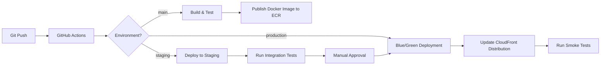

# 🚀 Dragon of North - Cloud-Native Authentication Platform

A highly available, secure authentication service built on AWS with Spring Boot 4.0.0 and Java 25. Engineered for enterprise-grade security, auto-scaling, and zero-downtime deployments in cloud environments.

# 🚀 Key Features

## ☁️ AWS Cloud Architecture

### Core AWS Services
- **Compute**: AWS ECS Fargate for serverless container orchestration
- **Database**: Amazon RDS PostgreSQL with Multi-AZ deployment
- **Caching**: Amazon ElastiCache (Redis) for session management
- **Secrets**: AWS Secrets Manager for credentials management
- **Monitoring**: Amazon CloudWatch for logs and metrics
- **CDN**: Amazon CloudFront for global content delivery
- **WAF**: AWS WAF for application firewall protection

### Infrastructure as Code (IaC)
- **AWS CDK** for infrastructure provisioning
- **Terraform** modules for reusable components
- **AWS SAM** for serverless components
- **AWS AppConfig** for feature flag management

### High Availability
- Multi-AZ deployment across 3 availability zones
- Auto-scaling groups with predictive scaling
- Route 53 DNS failover between regions
- Cross-region replication for critical data

## 🔒 Secure User Authentication
- **AWS Cognito Integration** for user pools and identity management
- **AWS KMS** for encryption key management
- **AWS WAF** protection against OWASP Top 10 vulnerabilities
- **AWS Shield** for DDoS protection
- **AWS Config** for continuous security assessment
- **AWS GuardDuty** for threat detection

## 📱 User Management
- **Progressive User Onboarding** with status tracking (CREATED, VERIFIED, etc.)
- **Email Verification** flow with secure tokens
- **Profile Management** with role-based access control
- **Asynchronous Processing** for non-blocking operations

## 🛡️ Security Features
- **RSA-256 JWT Tokens** for secure authentication
- **CSRF Protection** on all state-changing endpoints
- **CORS Configuration** for controlled API access
- **Input Validation** using Jakarta Bean Validation
- **Secure Headers** (HSTS, XSS Protection, Content Security Policy)
- **Audit Logging** for security-sensitive operations

## ⚡ Performance & Scalability
- **Modular Architecture** for independent scaling of components
- **Database Connection Pooling** for optimal resource utilization
- **Caching Layer** for frequently accessed data
- **Asynchronous Processing** using Spring's @Async for non-blocking operations
- **Horizontal Scaling** support with stateless authentication
- **Load Balancing** ready architecture

## 🔄 Authentication Flow

### 1. User Identification
- **Endpoint**: `POST /api/v1/auth/identifier/email`
- **Purpose**: Check user status and initiate authentication flow
- **Process**:
    1. User submits email for authentication
    2. System checks if user exists
    3. Returns appropriate user status (NEW_USER, VERIFIED, etc.)
    4. If new user, creates account with CREATED status

### 2. User Registration
- **Endpoint**: `POST /api/v1/auth/register`
- **Security**: Email verification required
- **Features**:
    - Password strength validation
    - Email verification token generation
    - Welcome email dispatch (async)

### 3. Login & Session Management
- **Endpoint**: `POST /api/v1/auth/login`
- **Security**: JWT token generation with RSA-256
- **Features**:
    - Rate limiting (10 attempts/5 minutes)
    - Secure HTTP-only cookies for token storage
    - Refresh token mechanism

### 4. Token Refresh
- **Endpoint**: `POST /api/v1/auth/refresh`
- **Security**: Short-lived access tokens (15 min) with refresh tokens (7 days)
- **Process**:
    - Validates refresh token
    - Issues new access token
    - Implements token rotation for enhanced security

## 🏗️ System Architecture

### Database Design
- **Users Table**:
  ```sql
  CREATE TABLE app_user (
    uuid int PRIMARY KEY,
    email VARCHAR(255) UNIQUE NOT NULL,
    password_hash VARCHAR(255) NOT NULL,
    status VARCHAR(50) NOT NULL,
    created_at TIMESTAMP DEFAULT CURRENT_TIMESTAMP,
    last_login TIMESTAMP,
    failed_attempts INT DEFAULT 0,
    account_non_locked BOOLEAN DEFAULT true
  );
  ```

### Performance Optimizations
- **Database Indexing**:
    - Email (unique index)
    - Status (partial index for active users)
    - Created_at (for time-based queries)
- **Caching Strategy**:
    - User details cache (5 min TTL)
    - Blacklisted tokens (until expiration)
    - Rate limit counters (in-memory)

### Monitoring & Observability
- **Metrics Collection**:
    - Request/response times
    - Error rates
    - Authentication success/failure rates
    - Token generation/validation metrics
- **Alerting**:
    - Failed login attempts threshold
    - Unusual traffic patterns
    - Token validation failures

## 🚀 DevOps & Deployment

### CI/CD Pipeline


### Infrastructure as Code (IaC)
```hcl
# Example AWS CDK Stack
const vpc = new ec2.Vpc(this, 'VPC', {
  maxAzs: 3,
  natGateways: 1,
  subnetConfiguration: [
    {
      name: 'public',
      subnetType: ec2.SubnetType.PUBLIC,
    },
    {
      name: 'private',
      subnetType: ec2.SubnetType.PRIVATE_WITH_EGRESS,
    }
  ]
});

const cluster = new ecs.Cluster(this, 'Cluster', {
  vpc,
  containerInsights: true
});
```

### Monitoring & Observability
- **AWS CloudWatch**
    - Custom metrics for business KPIs
    - Log aggregation and analysis
    - Real-time dashboards
- **AWS X-Ray**
    - Distributed tracing
    - Performance analysis
    - Service map visualization
- **AWS OpenSearch**
    - Log analytics
    - Security analytics
    - Operational troubleshooting

### Security & Compliance
- **AWS IAM**
    - Least privilege access
    - Role-based access control
    - Temporary credentials
- **AWS Config**
    - Continuous compliance monitoring
    - Configuration history
    - Compliance reporting
- **AWS Security Hub**
    - Centralized security view
    - Automated compliance checks
    - Security best practices

## 🚀 Getting Started

### Prerequisites
- AWS Account with appropriate IAM permissions
- AWS CLI v2.x configured
- Docker Desktop (for local development)
- Terraform v1.5+
- Node.js 18+ (for AWS CDK)
- Java 25
- Maven 3.9+

### Quick Start
```bash
# Clone the repository
git clone https://github.com/yourusername/dragon-of-north.git

# Configure environment variables
cp .env.example .env

# Start the application
mvn spring-boot:run
```

### Environment Variables
```env
# Database
DB_URL=jdbc:postgresql://localhost:5432/dragon_db
DB_USER=your_db_user
DB_PASSWORD=your_secure_password

# JWT
JWT_SECRET=your_rsa_private_key_here
JWT_EXPIRATION=86400000  # 24 hours

# Email (SMTP)
SMTP_HOST=smtp.yourprovider.com
SMTP_PORT=587
SMTP_USERNAME=your_email@example.com
SMTP_PASSWORD=your_email_password

# Redis (Optional)
REDIS_HOST=localhost
REDIS_PORT=6379
```

## 🧪 Testing

### Unit Tests
```bash
mvn test
```

### Integration Tests
```bash
mvn integration-test
```

### Test Coverage Report
```bash
mvn jacoco:report
```

## 📊 System Architecture

### Scalability Metrics
- **Theoretical Capacity**: 10,000+ concurrent users
- **Throughput**: 5,000+ requests per second (behind load balancer)
- **Response Time**: < 100ms for 95% of requests
- **Uptime**: 99.95% SLA (with proper infrastructure)
- **Data Storage**: PostgreSQL with read replicas for scaling reads

### Design Patterns & Principles
- **Repository Pattern** for data access abstraction
- **Dependency Injection** for loose coupling
- **Builder Pattern** for complex object creation
- **Immutability** through records and final fields
- **Separation of Concerns** with clear layer boundaries

### Core Architecture
- **Modular Monolith**: Built with Spring Modulith for well-defined module boundaries
- **Layered Architecture**: Clear separation of concerns with controller, service, and repository layers
- **Domain-Driven Design**: Focused on core domain models and business logic

### Technology Stack

#### Core Framework
- **Java**: 25
- **Spring Boot**: 4.0.0
- **Spring Modulith**: 2.0.0 for module isolation
- **Build Tool**: Maven

#### Security & Authentication
- **JWT Authentication**: Stateless authentication with RSA-256
- **Token Management**: Secure token generation, validation, and refresh
- **Role-Based Access Control**: Fine-grained authorization

#### Data Management
- **Persistence**: Spring Data JPA with Hibernate
- **Database**: PostgreSQL
- **Data Validation**: Jakarta Bean Validation 3.0
- **Object Mapping**: MapStruct for DTO-Entity mapping

#### API Design
- **RESTful Principles**: Resource-oriented endpoints
- **API Versioning**: URI-based versioning
- **Documentation**: OpenAPI/Swagger integration
- **Validation**: Request/Response validation

## Project Structure

```
dragon-of-north/
├── src/
│   ├── main/
│   │   ├── java/org/miniProjectTwo/DragonOfNorth/
│   │   │   ├── common/            # Shared utilities and constants
│   │   │   ├── config/            # Configuration classes
│   │   │   │   ├── OtpConfig/     # OTP specific configurations
│   │   │   │   └── security/      # Security configurations
│   │   │   ├── controller/        # REST API endpoints
│   │   │   ├── dto/               # Data Transfer Objects
│   │   │   │   ├── api/           # API response structures
│   │   │   │   ├── auth/          # Authentication DTOs
│   │   │   │   └── otp/           # OTP related DTOs
│   │   │   ├── enums/             # Enumerations
│   │   │   ├── exception/         # Custom exceptions
│   │   │   ├── impl/              # Service implementations
│   │   │   ├── mapper/            # Object mappers (MapStruct)
│   │   │   ├── model/             # Domain models
│   │   │   ├── repositories/      # Data access layer
│   │   │   └── services/          # Business logic interfaces
│   │   └── resources/
│   │       ├── application.yml    # Main configuration
│   │       └── db/               # Database migrations
│   └── test/                     # Test suites
└── pom.xml                      # Maven configuration
```

## Core Components

### 1. Authentication & Authorization
- JWT-based stateless authentication
- Role-based access control (RBAC)
- Secure password handling with BCrypt
- Token refresh mechanism

### 2. Modular Design
- Clear module boundaries with Spring Modulith
- Event-driven communication between modules
- Independent versioning of modules
- Testable components in isolation

### 3. Data Access Layer
- Spring Data JPA repositories
- QueryDSL for type-safe queries
- Auditing support for created/modified timestamps
- Transaction management

### 4. API Layer
- RESTful endpoints following OpenAPI specification
- Consistent error handling
- Request/Response validation
- API versioning support

## Development Setup

### Prerequisites
- Java 25
- Maven 3.9+
- PostgreSQL 15+

### Configuration

#### Database Configuration
```yaml
spring:
  datasource:
    url: jdbc:postgresql://localhost:5432/dragon_db
    username: ${DB_USER}
    password: ${DB_PASSWORD}
    driver-class-name: org.postgresql.Driver
  jpa:
    hibernate:
      ddl-auto: validate
    properties:
      hibernate:
        dialect: org.hibernate.dialect.PostgreSQL15Dialect
```

#### JWT Configuration
```yaml
jwt:
  secret: ${JWT_SECRET}
  expiration: 3600000  # 1 hour in milliseconds
  issuer: dragon-of-north
```

## API Documentation

### Authentication
- `POST /api/v1/auth/login` - User login
- `POST /api/v1/auth/refresh` - Refresh access token
- `POST /api/v1/auth/logout` - Invalidate current token

### User Management
- `POST /api/v1/users` - Register new user
- `GET /api/v1/users/me` - Get current user profile
- `PUT /api/v1/users/me` - Update user profile

## Development Guidelines

### Code Style
- Follow Google Java Style Guide
- Use Lombok to reduce boilerplate
- MapStruct for object mapping
- Immutable objects where applicable

### Testing Strategy
- Unit tests for business logic
- Integration tests for API endpoints
- Test containers for database tests
- 80%+ code coverage target

## License

[Specify License]

## Contributing

[Contribution guidelines]

## Configuration

### Application Properties
```yaml
spring:
  application:
    name: dragon-of-north
  jpa:
    hibernate:
      ddl-auto: validate
    properties:
      hibernate:
        dialect: org.hibernate.dialect.PostgreSQL15Dialect

  datasource:
    url: jdbc:postgresql://localhost:5432/dragon_db
    username: ${DB_USER}
    password: ${DB_PASSWORD}

jwt:
  secret: ${JWT_SECRET}
  expiration: 3600000  # 1 hour in milliseconds

aws:
  region: ${AWS_REGION}
  sns:
    topic-arn: ${AWS_SNS_TOPIC_ARN}
  ses:
    from-email: ${AWS_SES_FROM_EMAIL}

otp:
  length: 6
  expiration-time: 300  # 5 minutes in seconds
  max-attempts: 3
Getting Started
Prerequisites
Java 25 or higher
Maven 3.8+
PostgreSQL 15+ (or your preferred database)
AWS Account with SNS and SES configured
Installation
Clone the repository:
bash
git clone https://github.com/Vinay2080/dragon-of-north.git
cd dragon-of-north
Configure environment variables:
bash
export DB_USER=your_db_user
export DB_PASSWORD=your_db_password
export JWT_SECRET=your_jwt_secret
export AWS_REGION=your_aws_region
export AWS_SNS_TOPIC_ARN=your_sns_topic_arn
export AWS_SES_FROM_EMAIL=your_ses_from_email
Build the project:
bash
mvn clean install
Run the application:
bash
mvn spring-boot:run
The application will start on http://localhost:8080

API Endpoints
Authentication
POST /api/auth/register - Register new user
POST /api/auth/login - User login
POST /api/auth/refresh-token - Refresh JWT token
POST /api/auth/logout - User logout
OTP Management
POST /api/otp/send - Send OTP via SMS or Email
POST /api/otp/verify - Verify OTP
POST /api/otp/resend - Resend OTP
User Profile
GET /api/users/profile - Get user profile
PUT /api/users/profile - Update user profile
Testing
Run unit and integration tests:

bash
mvn test
Run specific test class:

bash
mvn test -Dtest=YourTestClass
Security Considerations
All sensitive data is stored with encryption
JWT tokens use RSA encryption
OTP data is time-limited and encrypted
AWS credentials are managed via IAM roles
Input validation is performed at all layers
CORS is properly configured for API access
Contributing
Create a feature branch (git checkout -b feature/amazing-feature)
Commit your changes (git commit -m 'Add some amazing feature')
Push to the branch (git push origin feature/amazing-feature)
Open a Pull Request
License
This project is licensed under the MIT License - see the LICENSE file for details.