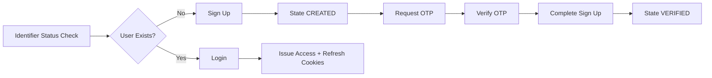
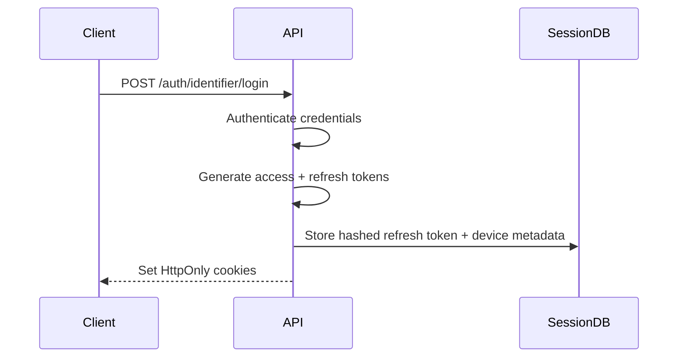
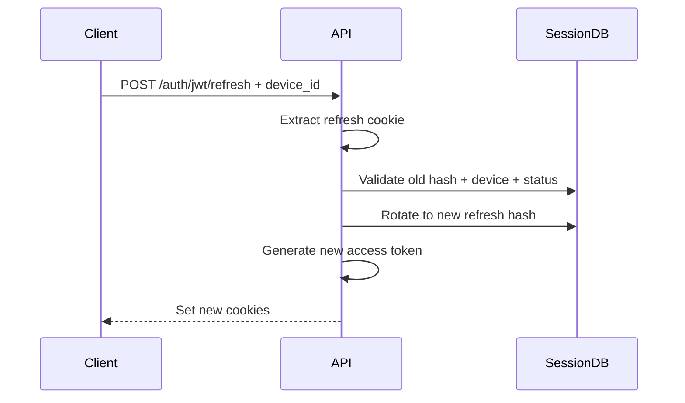
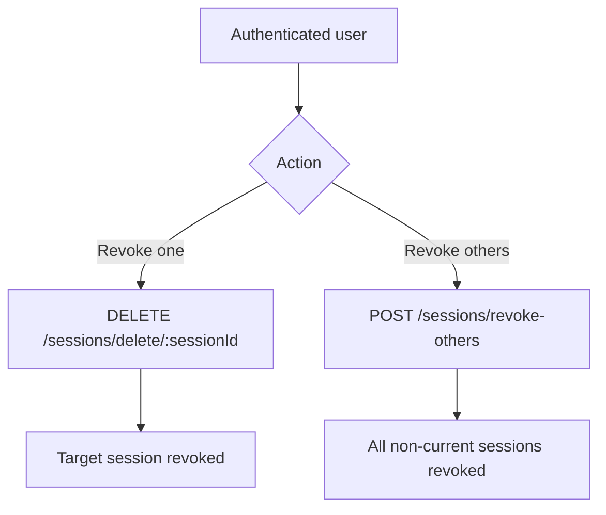
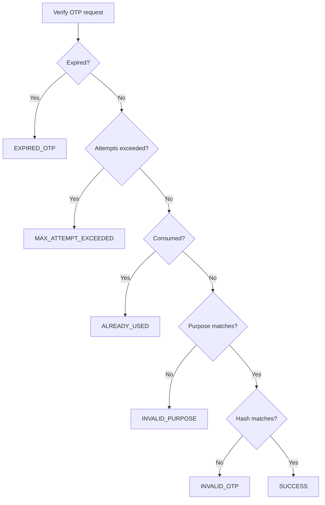
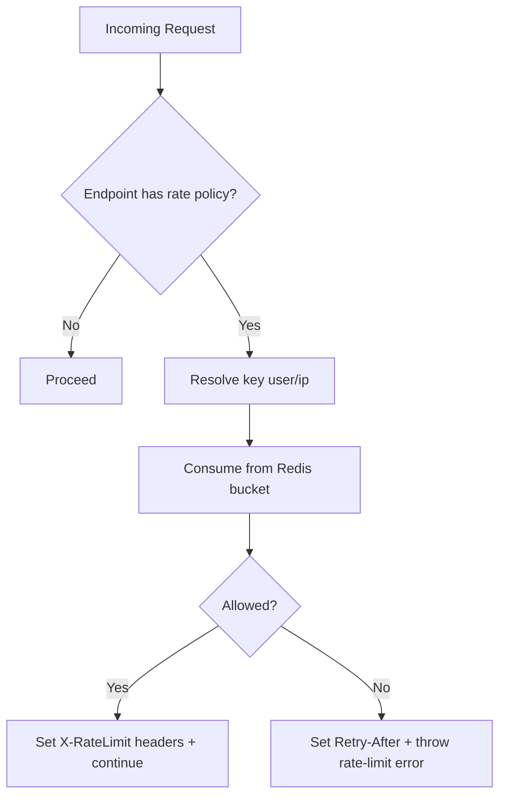

# Dragon of North

A production-style **authentication and session management platform** built with **Spring Boot + React**.

This repository is designed as an interview-ready portfolio project that demonstrates:
- secure auth architecture,
- OTP verification lifecycle,
- device-aware session management,
- distributed abuse prevention,
- structured API contracts,
- and full-stack integration.

---

## Table of Contents

- [1) Executive Summary](#1-executive-summary)
- [2) Index for features](#2-index-for-features)
- [3) Major Features](#3-major-features)
- [4) Minor-but-Important Engineering Features](#4-minor-but-important-engineering-features)
- [5) Tech Stack](#5-tech-stack)
- [6) Architecture Overview](#6-architecture-overview)
- [7) Visual Flows](#7-visual-flows)
- [8) Backend Deep Dive](#8-backend-deep-dive)
- [9) Frontend Deep Dive](#9-frontend-deep-dive)
- [10) Security Decisions & Tradeoffs](#10-security-decisions--tradeoffs)
- [11) API Overview](#11-api-overview)
- [12) Detailed API Payload Examples](#12-detailed-api-payload-examples)
- [13) Data Model Overview](#13-data-model-overview)
- [14) Error Handling & API Contract](#14-error-handling--api-contract)
- [15) Rate Limiting & Abuse Prevention](#15-rate-limiting--abuse-prevention)
- [16) Observability & Operations](#16-observability--operations)
- [17) Testing Strategy](#17-testing-strategy)
- [18) Local Development Setup](#18-local-development-setup)
- [19) Deployment Notes](#19-deployment-notes)
- [20) Summary in short](#205-summary-in-short)
- [21) What to Improve Next](#21-what-to-improve-next)
- [22) Project Structure](#22-project-structure)

---

## 1) Executive Summary

Dragon of North implements a complete identity flow:

1. Check identifier status (email/phone)
2. Start signup
3. Request OTP by purpose
4. Verify OTP
5. Complete signup
6. Login and issue access/refresh cookies
7. Create device-aware session
8. Refresh with token rotation
9. Logout and revoke session(s)

This project intentionally goes beyond “basic login/signup” by adding:
- security hardening details,
- session lifecycle controls,
- anti-abuse patterns,
- and interview-focused architecture clarity.

---

## 2) Index for features

- End-to-end auth + session lifecycle
- Explicit access/refresh token split
- HttpOnly cookie transport with Bearer fallback
- Refresh token hash-at-rest persistence
- Purpose-scoped OTP engine
- Distributed rate limiting via Redis + Bucket4j
- Structured error code catalog and global exception mapping
- Frontend behavior aligned with backend security model
- Session management UI actions (revoke one/revoke others)

---

## 3) Major Features

### 3.1 Authentication & User Lifecycle

- Identifier-based auth supports **EMAIL** and **PHONE**.
- User lifecycle statuses are explicit and interview-friendly:
  - `NOT_EXIST`
  - `CREATED`
  - `VERIFIED`
  - `DELETED`
- Signup is split into:
  - initiation (`sign-up`),
  - completion (`sign-up/complete`) after verification.
- Login validates credentials and establishes session state.

### 3.2 JWT + Cookie Security Model

- JWT model uses **access token + refresh token**.
- Token types are distinguished using a `token_type` claim.
- RSA key pair is used for signing and verification.
- Access token is used for API authorization.
- Refresh token is restricted to refresh flow.
- Access token extraction supports:
  - `Authorization: Bearer ...`
  - `access_token` cookie.

### 3.3 Session Management (Device-Aware)

- Session metadata persisted per device:
  - `device_id`
  - `ip_address`
  - `user_agent`
  - `last_used_at`
  - `expiry_date`
  - `revoked`
- Refresh flow validates session and rotates refresh token state.
- Endpoints to:
  - list sessions,
  - revoke one,
  - revoke all other sessions.

### 3.4 OTP Engine

- OTP supports email and phone channels.
- OTP purpose is required and validated:
  - `SIGNUP`
  - `LOGIN`
  - `PASSWORD_RESET`
  - `TWO_FACTOR_AUTH`
- OTP statuses include:
  - `SUCCESS`
  - `INVALID_OTP`
  - `EXPIRED_OTP`
  - `MAX_ATTEMPT_EXCEEDED`
  - `ALREADY_USED`
  - `INVALID_PURPOSE`
- OTP values are BCrypt-hashed before persistence.

### 3.5 Abuse Prevention

- Endpoint-specific rate limiting.
- Distributed bucket state in Redis.
- Headers exposed to client for better UX:
  - `X-RateLimit-Remaining`
  - `X-RateLimit-Capacity`
  - `Retry-After`

### 3.6 Operations Readiness

- PostgreSQL for persistence.
- Redis for rate limits/distributed state.
- AWS SES/SNS integration for OTP channels.
- Prometheus metrics + Actuator endpoints.
- Cleanup schedulers for OTP/session/user hygiene.

---

## 4) Minor-but-Important Engineering Features

These are “small” decisions that have real production value:

- Resolver pattern for identifier-type based service routing.
- DTO validation at controller boundaries.
- Standard API envelope for success/failure.
- Enum-driven error catalog for stability.
- Global exception handler with consistent payload shapes.
- Session summary DTO designed for frontend session dashboard.
- Single-flight refresh logic in frontend API layer.
- Rate-limit listener in frontend for live quota UI.
- Protected route with loading gate to avoid auth flicker.
- Device ID persistence in frontend for session continuity.

---

## 5) Tech Stack

### Backend

- Java 21
- Spring Boot
- Spring Security
- Spring Data JPA
- Springdoc OpenAPI (Swagger)
- PostgreSQL
- Redis + Bucket4j
- Micrometer + Prometheus
- AWS SDK (SES/SNS)

### Frontend

- React
- Vite
- TailwindCSS

### Testing

- JUnit 5
- Spring Boot Test
- Mockito
- Testcontainers

---

## 6) Architecture Overview

```text
React Frontend
   ↓
Spring Boot REST API
   ├── Controllers (Auth / OTP / Sessions)
   ├── Services (Business logic)
   ├── Repositories (JPA)
   ├── Security (JWT filter, auth manager)
   ├── Rate Limiter (Redis + Bucket4j)
   ├── Exception Layer (global mapping)
   ├── Scheduler (cleanup)
   └── Integrations (AWS SES/SNS)
        ↓
PostgreSQL + Redis
```

### Layering principles

- Controllers handle transport concerns only.
- Services own business logic and transitions.
- Repositories isolate persistence logic.
- Security and filter concerns are centralized.

---

## 7) Visual Flows

### 7.1 Account Lifecycle



### 7.2 Login + Session Creation



### 7.3 Refresh Rotation



### 7.4 Session Revocation



### 7.5 OTP Verification Logic



### 7.6 Rate-Limiting Flow



---

## 8) Backend Deep Dive

### 8.1 Authentication strategy routing

The service resolver dispatches authentication logic based on identifier type.

Benefits:
- clean channel-specific logic,
- easier extension for future identifiers,
- reduced controller complexity.

### 8.2 User lifecycle transition controls

The project uses explicit status transitions instead of ambiguous flags.

This gives:
- stronger state modeling,
- clearer business rules,
- easier testing and interview explanation.

### 8.3 Password and credential handling

- Passwords are encoded before persistence.
- Authentication leverages Spring Security manager.

### 8.4 JWT service responsibilities

JWT service handles:
- token generation,
- claim extraction,
- token expiration checks,
- token type validation,
- refresh access-token issuance.

### 8.5 JWT filter behavior

Filter pipeline:
1. skip public/doc endpoints,
2. extract token (header/cookie),
3. validate claims and token type,
4. map roles to authorities,
5. set Spring security context.

### 8.6 Session service behavior

Core operations include:
- create session,
- validate/rotate session,
- revoke session,
- revoke others,
- list sessions.

### 8.7 OTP service behavior

OTP service does:
- generation,
- hashing,
- persistence,
- send through sender interface,
- verify with status-based outcomes.

### 8.8 Cleanup scheduler behavior

Cleanup tasks remove:
- expired OTPs,
- old unverified users,
- expired sessions,
- stale revoked sessions.

---

## 9) Frontend Deep Dive

### 9.1 Auth context lifecycle

Auth context manages:
- startup auth probing,
- local auth state,
- login/logout integration,
- user object persistence.

### 9.2 API service behavior

The API abstraction supports:
- credentialed requests (`credentials: include`),
- refresh-on-401 retry,
- single-flight refresh lock,
- typed error result patterns,
- rate-limit header extraction.

### 9.3 Device identity handling

Frontend generates and persists device ID.
This ID is sent during:
- login,
- refresh,
- logout,
- revoke-others.

### 9.4 Session dashboard

Dashboard capabilities:
- session counters,
- session listing,
- current-device label,
- revoke single,
- revoke others.

### 9.5 Route protection

Protected routes include loading gate to avoid false redirects while auth is being resolved.

### 9.6 Rate-limit UX

Rate-limit component displays:
- remaining budget,
- low budget warning,
- retry countdown for blocked state.

---

## 10) Security Decisions & Tradeoffs

### 10.1 Why JWT + session table together?

JWT gives stateless authorization checks.
Session table gives revocation and device lifecycle control.

This hybrid model balances:
- scalability,
- control,
- and user security visibility.

### 10.2 Access vs refresh token split

- Access token: short-lived, used on protected APIs.
- Refresh token: longer-lived, restricted to refresh flow.

This reduces exposure window and improves UX.

### 10.3 Why HttpOnly cookies?

- Reduces JS token access risk.
- Works naturally with browser credential flows.
- Supports secure cross-origin policy with proper CORS setup.

### 10.4 Why hash refresh tokens in DB?

- Avoids storing raw long-lived credentials.
- Reduces blast radius of DB leaks.

### 10.5 Why purpose-scoped OTP?

- Prevents using one OTP across unrelated flows.
- Keeps verification semantics explicit.

### 10.6 Why endpoint-specific throttling?

Different endpoints have different risk profiles.
A single global limit is usually suboptimal for auth systems.

---

## 11) API Overview

Base path: `/api/v1`

### 11.1 Authentication

| Method | Endpoint | Description |
|---|---|---|
| POST | `/auth/identifier/status` | Get status for identifier |
| POST | `/auth/identifier/sign-up` | Start signup |
| POST | `/auth/identifier/sign-up/complete` | Complete signup |
| POST | `/auth/identifier/login` | Login and set cookies |
| POST | `/auth/jwt/refresh` | Rotate refresh and issue new access |
| POST | `/auth/identifier/logout` | Revoke current session |

### 11.2 OTP

| Method | Endpoint | Description |
|---|---|---|
| POST | `/otp/email/request` | Generate and send email OTP |
| POST | `/otp/email/verify` | Verify email OTP |
| POST | `/otp/phone/request` | Generate and send phone OTP |
| POST | `/otp/phone/verify` | Verify phone OTP |

### 11.3 Sessions

| Method | Endpoint | Description |
|---|---|---|
| GET | `/sessions/get/all` | List sessions for current user |
| DELETE | `/sessions/delete/{sessionId}` | Revoke one session |
| POST | `/sessions/revoke-others` | Revoke all except current device |

### 11.4 Documentation endpoints

- Swagger UI: `/swagger-ui/index.html`
- OpenAPI JSON: `/v3/api-docs`

---

## 12) Detailed API Payload Examples

### 12.1 Identifier status

```bash
curl -X POST http://localhost:8080/api/v1/auth/identifier/status \
  -H "Content-Type: application/json" \
  -d '{
    "identifier": "intern.candidate@example.com",
    "identifier_type": "EMAIL"
  }'
```

### 12.2 Signup

```bash
curl -X POST http://localhost:8080/api/v1/auth/identifier/sign-up \
  -H "Content-Type: application/json" \
  -d '{
    "identifier": "intern.candidate@example.com",
    "identifier_type": "EMAIL",
    "password": "Intern@123"
  }'
```

### 12.3 Request email OTP

```bash
curl -X POST http://localhost:8080/api/v1/otp/email/request \
  -H "Content-Type: application/json" \
  -d '{
    "email": "intern.candidate@example.com",
    "otp_purpose": "SIGNUP"
  }'
```

### 12.4 Verify email OTP

```bash
curl -X POST http://localhost:8080/api/v1/otp/email/verify \
  -H "Content-Type: application/json" \
  -d '{
    "email": "intern.candidate@example.com",
    "otp": "123456",
    "otp_purpose": "SIGNUP"
  }'
```

### 12.5 Complete signup

```bash
curl -X POST http://localhost:8080/api/v1/auth/identifier/sign-up/complete \
  -H "Content-Type: application/json" \
  -d '{
    "identifier": "intern.candidate@example.com",
    "identifier_type": "EMAIL"
  }'
```

### 12.6 Login

```bash
curl -X POST http://localhost:8080/api/v1/auth/identifier/login \
  -H "Content-Type: application/json" \
  -d '{
    "identifier": "intern.candidate@example.com",
    "password": "Intern@123",
    "device_id": "web-chrome-macos"
  }' \
  -c cookies.txt
```

### 12.7 Refresh

```bash
curl -X POST http://localhost:8080/api/v1/auth/jwt/refresh \
  -H "Content-Type: application/json" \
  -d '{
    "device_id": "web-chrome-macos"
  }' \
  -b cookies.txt -c cookies.txt
```

### 12.8 Sessions list

```bash
curl -X GET http://localhost:8080/api/v1/sessions/get/all \
  -b cookies.txt
```

### 12.9 Revoke session by id

```bash
curl -X DELETE "http://localhost:8080/api/v1/sessions/delete/<session-uuid>" \
  -b cookies.txt
```

### 12.10 Revoke others

```bash
curl -X POST http://localhost:8080/api/v1/sessions/revoke-others \
  -H "Content-Type: application/json" \
  -d '{
    "device_id": "web-chrome-macos"
  }' \
  -b cookies.txt
```

---

## 13) Data Model Overview

### 13.1 AppUser

Representative attributes:
- identifier fields (email/phone),
- password hash,
- lifecycle status,
- verification flags,
- failed attempts / lock metadata,
- role assignments,
- session relation.

### 13.2 Session

Representative attributes:
- refresh token hash,
- device + IP + UA metadata,
- expiry + last-used timestamps,
- revoke status.

### 13.3 OtpToken

Representative attributes:
- identifier + type,
- purpose,
- hashed OTP,
- created/sent/expiry times,
- attempts,
- consumed + verified timestamps,
- optimistic lock version.

### 13.4 Role/Permission

- role assignment supports authorization mapping.
- role names are added to JWT access claims.

---

## 14) Error Handling & API Contract

### 14.1 API response envelope

Both success and failure responses are returned using a consistent envelope.

### 14.2 Business exception mapping

Business exceptions are translated by global exception handler into predictable response payloads.

### 14.3 Error code catalog

Error codes are centralized and typed via enum to ensure stable API behavior.

### 14.4 Validation error structure

Validation errors include field-level detail so frontend can render actionable feedback.

### 14.5 Interview angle

A stable contract between frontend/backend is a major quality signal in team environments.

---

## 15) Rate Limiting & Abuse Prevention

### 15.1 Endpoint mapping

Endpoints are mapped to rate-limit types in config.

### 15.2 Bucket rules

Rules define:
- burst capacity,
- refill tokens,
- refill duration.

### 15.3 Distributed state

Redis stores bucket state for consistent enforcement across instances.

### 15.4 Key resolver

Resolver prefers authenticated user identity, otherwise falls back to client IP.

### 15.5 UX headers

Filter returns limit headers and retry guidance.

### 15.6 OTP anti-abuse

OTP layer has separate cooldown/window controls in addition to request-level rate limits.

---

## 16) Observability & Operations

### 16.1 Management endpoints

Actuator endpoints expose health and metrics.

### 16.2 Metrics

Prometheus export is enabled.
Rate-limit counters are tagged by type.

### 16.3 Logging

Important auth/session transitions are logged for diagnostics.

### 16.4 Scheduled cleanup

Cleanup tasks keep OTP/session tables healthy and remove stale records.

### 16.5 Operations value

These controls reduce long-term data growth and improve runtime maintainability.

---

## 17) Testing Strategy

### 17.1 Test layers present

- controller tests,
- service tests,
- repository tests,
- security/filter tests,
- rate-limit tests,
- integration tests.

### 17.2 What is validated

- auth status/signup/complete flows,
- OTP behavior,
- JWT parsing/filter behavior,
- session service operations,
- exception mapping,
- rate-limit path behavior.

### 17.3 Run tests

```bash
./mvnw test
```

Alternative:

```bash
mvn test
```

### 17.4 Integration test note

Integration tests rely on Testcontainers and are best run with Docker available.

---

## 18) Local Development Setup

### 18.1 Clone repository

```bash
git clone https://github.com/Vinay2080/dragon-of-north.git
cd dragon-of-north
```

### 18.2 Environment setup

Create `.env` in project root using keys referenced in `application.yaml`.

#### Database variables
- `db_name`
- `db_url`
- `db_port`
- `db_username`
- `db_password`
- `db_ddl_auto`

#### JWT variables
- `access_token`
- `refresh_token`
- `public_key_path`
- `private_key_path`

#### Redis variables
- `redis_host`
- `redis_password`

#### OTP variables
- `otp_length`
- `otp_ttl_minutes`
- `otp_max_verify_attempts`
- `otp_request_window_seconds`
- `otp_block_duration_minutes`
- `otp_resend_cooldown_seconds`
- `otp_max_requests_per_window`
- `otp_cleanup_delay_ms`

#### Auth throttle variables
- `auth_signup_request_window_seconds`
- `auth_signup_max_requests_per_window`
- `auth_signup_block_duration_minutes`
- `auth_login_max_failed_attempts`
- `auth_login_block_duration_minutes`

#### AWS variables
- `aws_region`
- `aws_ses_sender`

### 18.3 Run backend

```bash
./mvnw spring-boot:run
```

### 18.4 Run frontend

```bash
cd frontend
npm install
npm run dev
```

### 18.5 Useful URLs

- API: `http://localhost:8080`
- Swagger: `http://localhost:8080/swagger-ui/index.html`
- Frontend: `http://localhost:5173`

---

## 19) Deployment Notes

### 19.1 Backend deployment

- Use Dockerfile for container builds.
- Supply environment variables securely.
- Enforce HTTPS in production.

### 19.2 Frontend deployment

- Build and deploy static assets.
- Align CORS and cookie settings with deployed domains.

### 19.3 Production checklist

- rotate signing keys periodically,
- monitor auth error rates,
- tune rate-limit thresholds,
- tighten CORS allow-list,
- configure operational alerts.

---

## 20) Key points to note.

### 20.1 One-minute project pitch

> Dragon of North is a production-style auth platform where I implemented identifier-based signup/login, purpose-scoped OTP verification, JWT access/refresh lifecycle, and device-aware session revocation. I chose HttpOnly cookies, refresh rotation, and hashed refresh-token persistence to improve security. I also implemented distributed rate limiting using Redis + Bucket4j and standardized error contracts for frontend stability.

### 20.2 Key architecture points to explain

1. Why hybrid JWT + session persistence is used.
2. How refresh-token rotation is enforced.
3. How device ID enables targeted revocation.
4. Why enum-driven states improve correctness.
5. How rate-limit headers improve UX.

### 20.3 Some of very few questions I asked myself while building project.

**Q: Why not only JWT and no session table?**  
A: JWT provides stateless auth checks, but session table is needed for revocation/device visibility/rotation controls.

**Q: How do you reduce token theft risk?**  
A: Short-lived access token, HttpOnly cookies, refresh rotation, and hash-at-rest storage.

**Q: How do you prevent OTP abuse?**  
A: OTP cooldown + request windows + attempt limits + distributed endpoint throttling.

**Q: How does frontend handle access expiry?**  
A: refresh-on-401 with single-flight refresh lock and one retry.

### 20.4 Suggested live demo order

1. Identifier status check
2. Signup
3. OTP request + verify
4. Signup complete
5. Login
6. Session list
7. Refresh
8. Revoke others
9. Trigger rate-limited response

### 20.5 Summary in short

- Built a secure authentication platform with JWT access/refresh lifecycle, HttpOnly cookie transport, and refresh token rotation.
- Implemented device-aware session management with per-device metadata and revoke controls.
- Developed purpose-scoped OTP service with BCrypt hash-at-rest and anti-abuse protections.
- Added Redis + Bucket4j distributed rate limiting and surfaced quota headers for client UX.
- Standardized API error contracts via global exception handling and enum-based error codes.

---

## 21) What to Improve Next

### 21.1 Security hardening ideas

- refresh token reuse detection,
- richer anomaly detection on login behavior,
- optional stronger device-fingerprint scoring.

### 21.2 API expansion ideas

- admin session visibility/revocation,
- pagination/filtering on sessions,
- richer audit event endpoints.

### 21.3 Frontend improvements

- dedicated manage-sessions route/page refinements,
- stronger error reason rendering by backend code,
- optimistic UI enhancements for revoke operations.

### 21.4 Ops improvements

- dashboard/alerts for auth anomaly metrics,
- structured audit stream,
- policy-driven alerting thresholds.

---

## 22) Project Structure

```text
src
├── main
│   ├── java
│   │   └── org
│   │       └── miniProjectTwo
│   │           └── DragonOfNorth
│   │               ├── DragonOfNorthApplication.java
│   │               ├── components
│   │               │   └── TokenHasher.java
│   │               ├── config
│   │               │   ├── AuditorAwareImpl.java
│   │               │   ├── BeansConfig.java
│   │               │   ├── JpaConfig.java
│   │               │   ├── OpenApiConfig.java
│   │               │   ├── OtpConfig
│   │               │   │   ├── SesConfig.java
│   │               │   │   └── SnsConfig.java
│   │               │   ├── RateLimitConfig.java
│   │               │   ├── RateLimitProperties.java
│   │               │   ├── initializer
│   │               │   │   ├── RolesInitializer.java
│   │               │   │   └── TestDataInitializer.java
│   │               │   └── security
│   │               │       ├── AppUserDetails.java
│   │               │       ├── CorsConfig.java
│   │               │       ├── JwtFilter.java
│   │               │       ├── JwtServicesImpl.java
│   │               │       ├── KeyUtils.java
│   │               │       └── SecurityConfig.java
│   │               ├── controller
│   │               │   ├── AuthenticationController.java
│   │               │   ├── OtpController.java
│   │               │   └── SessionController.java
│   │               ├── dto
│   │               │   ├── api
│   │               │   │   ├── ApiResponse.java
│   │               │   │   └── ErrorResponse.java
│   │               │   ├── auth
│   │               │   │   ├── request
│   │               │   │   │   ├── AppUserLoginRequest.java
│   │               │   │   │   ├── AppUserSignUpCompleteRequest.java
│   │               │   │   │   ├── AppUserSignUpRequest.java
│   │               │   │   │   ├── AppUserStatusFinderRequest.java
│   │               │   │   │   └── DeviceIdRequest.java
│   │               │   │   └── response
│   │               │   │       └── AppUserStatusFinderResponse.java
│   │               │   ├── otp
│   │               │   │   └── request
│   │               │   │       ├── EmailOtpRequest.java
│   │               │   │       ├── EmailVerifyRequest.java
│   │               │   │       ├── PhoneOtpRequest.java
│   │               │   │       └── PhoneVerifyRequest.java
│   │               │   ├── package-info.java
│   │               │   └── session
│   │               │       └── response
│   │               │           └── SessionSummaryResponse.java
│   │               ├── enums
│   │               │   ├── ApiResponseStatus.java
│   │               │   ├── AppUserStatus.java
│   │               │   ├── ErrorCode.java
│   │               │   ├── IdentifierType.java
│   │               │   ├── OtpPurpose.java
│   │               │   ├── OtpVerificationStatus.java
│   │               │   ├── RateLimitType.java
│   │               │   └── RoleName.java
│   │               ├── exception
│   │               │   ├── ApplicationExceptionHandler.java
│   │               │   ├── BusinessException.java
│   │               │   └── ExceptionHandlerFilter.java
│   │               ├── model
│   │               │   ├── AppUser.java
│   │               │   ├── BaseEntity.java
│   │               │   ├── OtpToken.java
│   │               │   ├── Permission.java
│   │               │   ├── Role.java
│   │               │   └── Session.java
│   │               ├── ratelimit
│   │               │   ├── RateLimitBucketServiceImpl.java
│   │               │   └── RateLimitFilter.java
│   │               ├── repositories
│   │               │   ├── AppUserRepository.java
│   │               │   ├── OtpTokenRepository.java
│   │               │   ├── RoleRepository.java
│   │               │   └── SessionRepository.java
│   │               ├── resolver
│   │               │   ├── AuthenticationServiceResolver.java
│   │               │   └── RateLimitKeyResolver.java
│   │               ├── serviceInterfaces
│   │               │   ├── AuthCommonServices.java
│   │               │   ├── AuthenticationService.java
│   │               │   ├── JwtServices.java
│   │               │   ├── OtpSender.java
│   │               │   ├── OtpService.java
│   │               │   ├── RateLimitBucketService.java
│   │               │   └── SessionService.java
│   │               └── services
│   │                   ├── AppUserDetailService.java
│   │                   ├── CleanupTask.java
│   │                   ├── auth
│   │                   │   ├── AuthCommonServiceImpl.java
│   │                   │   ├── EmailAuthenticationServiceImpl.java
│   │                   │   ├── PhoneAuthenticationServiceImpl.java
│   │                   │   └── SessionServiceImpl.java
│   │                   ├── otp
│   │                   │   ├── EmailOtpSender.java
│   │                   │   ├── OtpServiceImpl.java
│   │                   │   ├── PhoneOtpSender.java
│   │                   │   └── SesEmailService.java
│   │                   └── package-info.java
│   └── resources
│       ├── META-INF
│       │   └── additional-spring-configuration-metadata.json
│       └── application.yaml

## 23) License

MIT

---

## Appendix A: Extended Endpoint Notes

### Authentication endpoints

- `/auth/identifier/status`: used to determine UI path.
- `/auth/identifier/sign-up`: creates user in `CREATED`.
- `/auth/identifier/sign-up/complete`: finalizes `VERIFIED` transition.
- `/auth/identifier/login`: validates credentials and sets auth cookies.
- `/auth/jwt/refresh`: rotates refresh state and refreshes access token.
- `/auth/identifier/logout`: revokes current session and clears cookies.

### OTP endpoints

- request endpoints generate purpose-scoped OTP tokens.
- verify endpoints return explicit status enums.

### Session endpoints

- list sessions for current user,
- revoke one by session ID,
- revoke all except current device.

---

## Appendix B: Feature Checklist

### Authentication
- [x] Email and phone identifier support
- [x] Status endpoint
- [x] Signup and signup completion
- [x] Login and logout

### JWT & Session
- [x] Access/refresh token split
- [x] Token type validation
- [x] JWT roles claim mapping
- [x] Session creation and listing
- [x] Session revoke one / revoke others
- [x] Refresh token hash storage
- [x] Refresh token rotation

### OTP
- [x] Email OTP request/verify
- [x] Phone OTP request/verify
- [x] Purpose-based OTP validation
- [x] Attempt + expiry + consumed checks
- [x] OTP anti-abuse controls

### Abuse prevention
- [x] Endpoint-specific rate limiting
- [x] Redis distributed bucket state
- [x] Quota/retry headers

### API quality
- [x] Global exception mapping
- [x] Error code enum catalog
- [x] DTO validation
- [x] OpenAPI docs

### Frontend
- [x] Auth context
- [x] Refresh-on-401 single-flight retry
- [x] Protected routes
- [x] Session dashboard actions
- [x] Rate-limit UI

### Operations
- [x] Actuator + Prometheus
- [x] Cleanup tasks
- [x] Dockerfile

---

## Appendix C: Topics focused while building this project

1. **Security design** (not just endpoint count)
2. **Lifecycle modeling** (user, token, OTP, session)
3. **Abuse prevention strategy** (rate limits + OTP controls)
4. **Frontend/backend coordination** (device id + cookie model)
5. **Maintainability patterns** (enums, global error mapping, layered architecture)

This framing makes your project sound like real engineering work instead of a tutorial clone.
