# Dragon of North

A production-style **authentication and session management platform** built with **Spring Boot + React**.

This repository is designed as an interview-ready portfolio project that demonstrates:
- secure auth architecture,
- OTP verification lifecycle,
- device-aware session management,
- distributed abuse prevention,
- structured API contracts,
- and full-stack integration.

---

## Table of Contents

- [0) Recent Updates](#0-recent-updates)
- [1) Executive Summary](#1-executive-summary)
- [2) Index for features](#2-index-for-features)
- [3) Major Features](#3-major-features)
- [4) Minor-but-Important Engineering Features](#4-minor-but-important-engineering-features)
- [5) Tech Stack](#5-tech-stack)
- [6) Architecture Overview](#6-architecture-overview)
- [6.1) Spring Security Filter Layers](#61-spring-security-filter-layers)
- [6.2) Database Schema & Entity Relationships](#62-database-schema--entity-relationships)
- [6.3) Service Architecture & Dependency Injection](#63-service-architecture--dependency-injection)
- [6.4) AWS Integration Architecture](#64-aws-integration-architecture)
- [6.5) Rate Limiting Algorithm Flow](#65-rate-limiting-algorithm-flow)
- [6.6) Token Lifecycle Management](#66-token-lifecycle-management)
- [6.7) Design Patterns & Architecture Decisions](#67-design-patterns--architecture-decisions)
- [6.8) Performance & Scalability Considerations](#68-performance--scalability-considerations)
- [7) Visual Flows](#7-visual-flows)
- [8) Backend Deep Dive](#8-backend-deep-dive)
- [9) Frontend Deep Dive](#9-frontend-deep-dive)
- [10) Security Decisions & Tradeoffs](#10-security-decisions--tradeoffs)
- [11) API Overview](#11-api-overview)
- [12) Detailed API Payload Examples](#12-detailed-api-payload-examples)
- [13) Data Model Overview](#13-data-model-overview)
- [14) Error Handling & API Contract](#14-error-handling--api-contract)
- [15) Rate Limiting & Abuse Prevention](#15-rate-limiting--abuse-prevention)
- [16) Observability & Operations](#16-observability--operations)
- [16.1) EC2 Cron Jobs for Image Cleanup](#161-ec2-cron-jobs-for-image-cleanup)
- [16.2) Testing Architecture](#162-testing-architecture)
- [16.3) Monitoring & Observability Deep Dive](#163-monitoring--observability-deep-dive)
- [17) Testing Strategy](#17-testing-strategy)
- [18) Local Development Setup](#18-local-development-setup)
- [19) Deployment Notes](#19-deployment-notes)
- [21) What to Improve Next](#21-what-to-improve-next)
- [22) Project Structure](#22-project-structure)

---

## 0) Recent Updates

### ✅ Forgot Password (Phase 1)

- Added endpoints:
    - `POST /api/v1/auth/password/forgot/request`
    - `POST /api/v1/auth/password/forgot/reset`
- Reuses OTP purpose `PASSWORD_RESET`.
- Resets password and revokes all active sessions for the user.
- Frontend includes complete request+reset flow pages.

### ✅ Structured Audit Logs (Phase 2)

- Standardized backend audit log format across auth/session/otp-critical flows:
    - `event`, `user_id`, `device_id`, `ip`, `result`, `reason`, `request_id`
- Coverage includes:
    - login success/failure
    - refresh success/failure
    - logout success/failure
    - session revoke (current/by-id/others/all)
    - password reset request/confirm
    - signup and signup complete
    - otp request/verify outcomes

### ✅ Metrics Completeness (Phase 3)

- Added and normalized Micrometer counters for auth/session/otp:
    - `auth.login.success|failure`
    - `auth.refresh.success|failure`
    - `auth.logout.success|failure`
    - `auth.password_reset.requested|success|failure`
    - `auth.signup.success|failure`
    - `auth.signup.complete.success|failure`
    - `auth.otp.request.success|failure`
    - `auth.otp.verify.success|failure`
    - `session.revoked.current|by_id|others|all_user|failure`

### ✅ DB Migration Status

- Flyway migrations are currently present:
    - `V1__init.sql`
    - `V2__added_column_nickname.sql`
    - `V3__removed_column_nickname.sql`
    - `V4__match_prod_and_local.sql`

### 🧪 Testing Status Notes

- Existing controller/service/repository/unit/integration tests remain in place.
- Added/updated tests to align with observability dependencies where service constructors were expanded.
- Recommended next incremental coverage:
    - explicit assertions for audit logger interactions (event names/reasons)
    - metrics counter assertions for success/failure branches
    - integration smoke for password-reset + session-revocation side effects

---

## 1) Executive Summary

Dragon of North implements a complete identity flow:

1. Check identifier status (email/phone)
2. Start signup
3. Request OTP by purpose
4. Verify OTP
5. Complete signup
6. Login and issue access/refresh cookies
7. Create a device-aware session
8. Refresh with token rotation
9. Logout and revoke session(s)

This project intentionally goes beyond “basic login/signup” by adding:
- security hardening details,
- session lifecycle controls,
- anti-abuse patterns,
- and interview-focused architecture clarity.

---

## 2) Index for features

- End-to-end auth and session lifecycle
- Explicit access/refresh token split
- HttpOnly cookie transport with Bearer fallback
- Refresh token hash-at-rest persistence
- Purpose-scoped OTP engine
- Distributed rate limiting via Redis + Bucket4j
- Structured error code catalog and global exception mapping
- Frontend behavior aligned with a backend security model
- Session management UI actions (revoke one/revoke others)

---

## 3) Major Features

### 3.1 Authentication & User Lifecycle

- Identifier-based auth supports **EMAIL** and **PHONE**.
- User lifecycle statuses are explicit and interview-friendly:
  - `NOT_EXIST`
  - `CREATED`
  - `VERIFIED`
  - `DELETED`
- Signup is split into:
  - initiation (`sign-up`),
  - completion (`sign-up/complete`) after verification.
- Login validates credentials and establishes session state.

### 3.2 JWT + Cookie Security Model

- JWT model uses **access token + refresh token**.
- Token types are distinguished using a `token_type` claim.
- RSA key pair is used for signing and verification.
- Access token is used for API authorization.
- Refresh token is restricted to refresh flow.
- Access token extraction supports:
  - `Authorization: Bearer ...`
  - `access_token` cookie.

### 3.3 Session Management (Device-Aware)

- Session metadata persisted per device:
  - `device_id`
  - `ip_address`
  - `user_agent`
  - `last_used_at`
  - `expiry_date`
  - `revoked`
- Refresh flow validates the session and rotates the refresh token state.
- Endpoints to:
  - list sessions,
  - revoke one,
  - revoke all other sessions.

### 3.4 OTP Engine

- OTP supports email and phone channels.
- OTP purpose is required and validated:
  - `SIGNUP`
  - `LOGIN`
  - `PASSWORD_RESET`
  - `TWO_FACTOR_AUTH`
- OTP statuses include:
  - `SUCCESS`
  - `INVALID_OTP`
  - `EXPIRED_OTP`
  - `MAX_ATTEMPT_EXCEEDED`
  - `ALREADY_USED`
  - `INVALID_PURPOSE`
- OTP values are BCrypt-hashed before persistence.

### 3.5 Abuse Prevention

- Endpoint-specific rate limiting.
- Distributed bucket state in Redis.
- Headers exposed to a client for better UX:
  - `X-RateLimit-Remaining`
  - `X-RateLimit-Capacity`
  - `Retry-After`

### 3.6 Operations Readiness

- PostgreSQL for persistence.
- Redis for rate limits/distributed state.
- AWS SES/SNS integration for OTP channels.
- Prometheus metrics + Actuator endpoints.
- Cleanup schedulers for OTP/session/user hygiene.

---

## 4) Minor-but-Important Engineering Features

These are “small” decisions that have real production value:

- Resolver pattern for identifier-type-based service routing.
- DTO validation at controller boundaries.
- Standard API envelope for success/failure.
- Enum-driven error catalog for stability.
- Global exception handler with consistent payload shapes.
- Session summary DTO designed for the frontend session dashboard.
- Single-flight refresh logic in the frontend API layer.
- Rate-limit listener in the frontend for live quota UI.
- Protected route with a loading gate to avoid auth flicker.
- Device ID persistence in the frontend for session continuity.

---

## 5) Tech Stack

### Backend

- Java 21
- Spring Boot
- Spring Security
- Spring Data JPA
- Flyway (database migration)
- Springdoc OpenAPI (Swagger)
- PostgreSQL
- Redis + Bucket4j
- Micrometer + Prometheus
- AWS SDK (SES/SNS)

### Frontend

- React
- Vite
- TailwindCSS

### Testing

- JUnit 5
- Spring Boot Test
- Mockito
- Testcontainers

---

## 6) Architecture Overview

```text
React Frontend
   ↓
Spring Boot REST API
   ├── Controllers (Auth / OTP / Sessions)
   ├── Services (Business logic)
   ├── Repositories (JPA)
   ├── Security (JWT filter, auth manager)
   ├── Rate Limiter (Redis + Bucket4j)
   ├── Exception Layer (global mapping)
   ├── Scheduler (cleanup)
   └── Integrations (AWS SES/SNS)
        ↓
PostgresSQL + Redis
```

### Layering principles

- Controllers handle transport concerns only.
- Services own business logic and transitions.
- Repositories isolate persistence logic.
- Security and filter concerns are centralized.

---

## 6.1) Spring Security Filter Layers

The application implements a comprehensive, multi-layered Spring Security filter chain that provides defense-in-depth
security controls. Each filter adds specific security capabilities in a carefully ordered pipeline.

### 6.1.1 Filter Chain Architecture

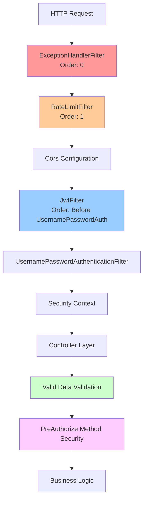
```mermaid
flowchart TD
    A[HTTP Request] --> B[ExceptionHandlerFilter<br/>Order: 0]
    B --> C[RateLimitFilter<br/>Order: 1]
    C --> D[Cors Configuration]
    D --> E[JwtFilter<br/>Order: Before UsernamePasswordAuth]
    E --> F[UsernamePasswordAuthenticationFilter]
    F --> G[Security Context]
    G --> H[Controller Layer]
    H --> I[Valid Data Validation]
    I --> J[PreAuthorize Method Security]
    J --> K[Business Logic]
    style B fill: #ff9999
    style C fill: #ffcc99
    style E fill: #99ccff
    style I fill: #ccffcc
    style J fill: #ffccff
```

### 6.1.2 Filter Layer Breakdown

#### **ExceptionHandlerFilter** (Order: 0)

- **Purpose**: Global exception handling for a filter chain
- **Features**:
    - Catches `BusinessException` from any filter
    - Returns standardized JSON error responses
    - Maintains API contract consistency
- **Implementation**: `ExceptionHandlerFilter.java`
- **Key Benefit**: Prevents unhandled exceptions from breaking security flow

#### **RateLimitFilter** (Order: 1)

- **Purpose**: Distributed rate limiting and abuse prevention
- **Features**:
    - Redis-based distributed bucket state via Bucket4j
    - Endpoint-specific rate limit policies
    - User/IP-based key resolution
    - Client-friendly headers (`X-RateLimit-*`, `Retry-After`)
    - Prometheus metrics for blocked/success requests
- **Implementation**: `RateLimitFilter.java`
- **Key Benefit**: Prevents brute force attacks and API abuse

#### **CORS Configuration**

- **Purpose**: Cross-origin resource sharing control
- **Features**:
    - Configurable origin allowlist
    - Secure header management
    - Pre-flight request handling
- **Implementation**: `CorsConfig.java`
- **Key Benefit**: Enables secure frontend integration

#### **JwtFilter** (Order: Before UsernamePasswordAuth)

- **Purpose**: JWT token validation and authentication
- **Features**:
    - Dual token extraction (Bearer header and HttpOnly cookie)
    - Token type validation (access_token only)
    - Claims extraction and role mapping
    - Silent failure for invalid tokens
    - Spring Security context population
- **Implementation**: `JwtFilter.java`
- **Key Benefit**: Stateless authentication with role-based access

#### **UsernamePasswordAuthenticationFilter**

- **Purpose**: Traditional form-based authentication
- **Features**:
    - Integration with AuthenticationManager
    - Bcrypt password validation
    - Session management fallback
- **Key Benefit**: Supports multiple authentication mechanisms

### 6.1.3 Controller Layer Security Features

#### **Data Validation** (@Valid/@Validated)

- **Purpose**: Input validation and sanitization
- **Features**:
    - DTO-level validation annotations
    - Automatic constraint violation handling
    - Field-level error responses
- **Implementation**: Controller method parameters
- **Key Benefit**: Prevents malformed data and injection attacks

#### **Method Security** (@PreAuthorize)

- **Purpose**: Fine-grained authorization control
- **Features**:
    - Role-based access control
    - Method-level security rules
    - SpEL expression support
- **Example**: `@PreAuthorize("isAuthenticated()")`
- **Key Benefit**: Zero-trust authorization at business logic level

### 6.1.4 Security Headers & Hardening

The SecurityConfig adds comprehensive security headers:

- **Content Security Policy**: `default-src 'self'`
- **XSS Protection**: Disabled in favor of CSP
- **HTTP Strict Transport Security**: HSTS with subdomains
- **Frame Options**: Same-origin protection

### 6.1.5 Public vs. Private Endpoint Control

**Public Endpoints** (No authentication required):

- `/api/v1/auth/**` - Authentication flows
- `/api/v1/otp/**` - OTP verification
- `/swagger-ui/**` - API documentation
- `/actuator/**` - Health checks and metrics

**Protected Endpoints** (Authentication required):

- `/api/v1/sessions/**` - Session management
- All other business endpoints

### 6.1.6 Security Flow Summary

1. **Request enters** → ExceptionHandlerFilter catches any filter exceptions
2. **Rate limiting** → Redis bucket validation with user/IP keys
3. **CORS check** → Cross-origin policy validation
4. **JWT validation** → Token extraction, claims validation, context setting
5. **Authentication** → Spring Security authentication flow
6. **Authorization** → Method-level @PreAuthorize checks
7. **Validation** → @Valid DTO validation
8. **Business logic** → Secure execution with authenticated context

This layered approach ensures that even if one security control fails, multiple layers provide defense-in-depth
protection.

---

## 6.2) Database Schema & Entity Relationships

The application uses a well-structured relational database design with clear entity relationships and audit
capabilities.

### 6.2.1 Entity Relationship Diagram

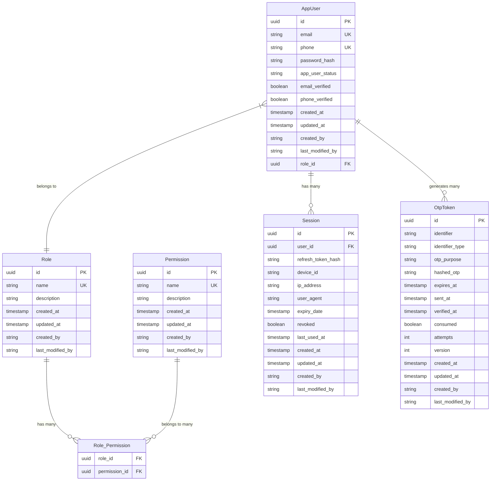
```mermaid
erDiagram
    AppUser {
        uuid id PK
        string email UK
        string phone UK
        string password_hash
        string app_user_status
        boolean email_verified
        boolean phone_verified
        timestamp created_at
        timestamp updated_at
        string created_by
        string last_modified_by
        uuid role_id FK
    }

    Role {
        uuid id PK
        string name UK
        string description
        timestamp created_at
        timestamp updated_at
        string created_by
        string last_modified_by
    }

    Permission {
        uuid id PK
        string name UK
        string description
        timestamp created_at
        timestamp updated_at
        string created_by
        string last_modified_by
    }

    Session {
        uuid id PK
        uuid user_id FK
        string refresh_token_hash
        string device_id
        string ip_address
        string user_agent
        timestamp expiry_date
        boolean revoked
        timestamp last_used_at
        timestamp created_at
        timestamp updated_at
        string created_by
        string last_modified_by
    }

    OtpToken {
        uuid id PK
        string identifier
        string identifier_type
        string otp_purpose
        string hashed_otp
        timestamp expires_at
        timestamp sent_at
        timestamp verified_at
        boolean consumed
        int attempts
        int version
        timestamp created_at
        timestamp updated_at
        string created_by
        string last_modified_by
    }

    Role_Permission {
        uuid role_id FK
        uuid permission_id FK
    }

    AppUser ||--o{ Session: "has many"
    AppUser ||--o{ OtpToken: "generates many"
    AppUser }|--|| Role: "belongs to"
    Role ||--o{ Role_Permission: "has many"
    Permission ||--o{ Role_Permission: "belongs to many"
```

### 6.2.2 Entity Descriptions

#### **AppUser** (Core Entity)

- **Purpose**: Central user identity and authentication data
- **Key Fields**:
    - `email`/`phone`: Unique identifiers with mutual exclusivity
    - `app_user_status`: Lifecycle state (NOT_EXIST, CREATED, VERIFIED, DELETED)
    - `password_hash`: Bcrypt-encoded credentials
    - `email_verified`/`phone_verified`: Channel verification status
- **Audit Fields**: `created_at`, `updated_at`, `created_by`, `last_modified_by`
- **Relationships**: One-to-many with Sessions and OtpTokens

#### **Session** (Security Entity)

- **Purpose**: Device-aware session management and token storage
- **Key Fields**:
    - `refresh_token_hash`: BCrypt hash of refresh token (never store raw)
    - `device_id`: Unique device identifier for multi-device support
    - `ip_address`/`user_agent`: Device fingerprinting
    - `revoked`: Session invalidation flag
- **Security Features**: Token rotation, device tracking, expiry management
- **Audit Fields**: Full audit trail for session lifecycle

#### **OtpToken** (Temporary Entity)

- **Purpose**: Short-lived OTP tokens for verification flows
- **Key Fields**:
    - `identifier`/`identifier_type`: Target contact information
    - `otp_purpose`: Usage context (SIGNUP, LOGIN, PASSWORD_RESET, TWO_FACTOR_AUTH)
    - `hashed_otp`: BCrypt hash of OTP value
    - `consumed`: Prevents reuse of verified tokens
- **Security Features**: Attempt limiting, expiration, purpose validation
- **Optimistic Locking**: `version` field for concurrent updates

#### **Role & Permission** (Authorization Entity)

- **Purpose**: Role-based access control (RBAC) system
- **Design**: Many-to-many relationship for flexible permissions
- **Usage**: JWT claims include role names for authorization
- **Audit Fields**: Complete change tracking for compliance

### 6.2.3 Database Design Principles

#### **Security-First Design**

- **No Plain Secrets**: All sensitive data BCrypt-hashed
- **Audit Trail**: Every entity tracks creation/modification
- **Data Minimization**: Only store necessary user data
- **Temporal Isolation**: Clear separation of permanent vs. temporary data

#### **Performance Considerations**

- **Strategic Indexing**:
    - Unique constraints on identifiers
    - Composite indexes on user_id + status
    - Time-based indexes for cleanup operations
- **Query Optimization**: Efficient session lookups by device/user
- **Cleanup-Friendly**: Easy identification of expired records

#### **Scalability Features**

- **Horizontal Scaling**: User-sharding friendly design
- **Temporal Partitioning**: Easy archival of old sessions/OTPs
- **Connection Pooling**: Optimized for high-concurrency access

### 6.2.4 Data Flow Patterns

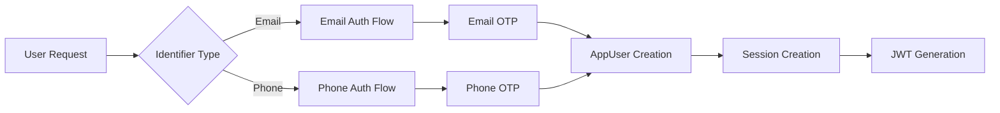
```mermaid
flowchart LR
    A[User Request] --> B{Identifier Type}
    B -->|Email| C[Email Auth Flow]
    B -->|Phone| D[Phone Auth Flow]
    C --> E[Email OTP]
    D --> F[Phone OTP]
    E --> G[AppUser Creation]
    F --> G
    G --> H[Session Creation]
    H --> I[JWT Generation]
```

### 6.2.5 Database Migration Strategy

- **Version Control**: Flyway migrations with semantic versioning
- **Backward Compatibility**: Non-breaking schema changes
- **Rollback Capability**: Downward migration scripts
- **Zero-Downtime**: Online schema changes for production

---

## 6.3) Service Architecture & Dependency Injection

The application follows a layered service architecture with clear separation of concerns and dependency injection
patterns.

### 6.3.1 Service Layer Architecture

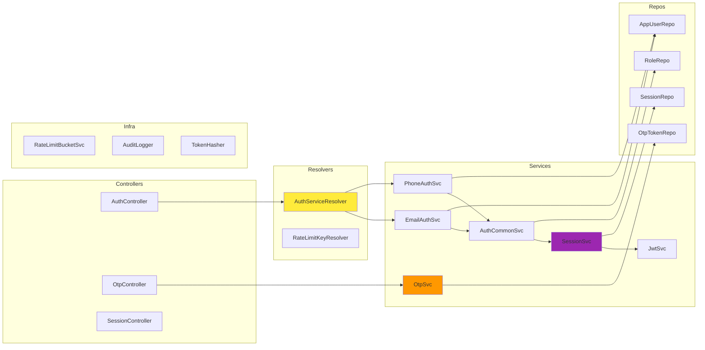
```mermaid
flowchart LR
    subgraph Controllers
        A[AuthController]
        B[OtpController]
        C[SessionController]
    end

    subgraph Resolvers
        D[AuthServiceResolver]
        E[RateLimitKeyResolver]
    end

    subgraph Services
        F[EmailAuthSvc]
        G[PhoneAuthSvc]
        H[AuthCommonSvc]
        I[OtpSvc]
        J[SessionSvc]
        K[JwtSvc]
    end

    subgraph Repos
        O[AppUserRepo]
        P[SessionRepo]
        Q[OtpTokenRepo]
        R[RoleRepo]
    end

    subgraph Infra
        S[RateLimitBucketSvc]
        T[AuditLogger]
        U[TokenHasher]
    end

    A --> D
    D --> F
    D --> G
    F --> H
    G --> H
    H --> J
    J --> K
    B --> I
    I --> Q
    J --> P
    F --> O
    G --> O
    H --> R
    style D fill: #ffeb3b
    style I fill: #ff9800
    style J fill: #9c27b0
```

### 6.3.2 Dependency Injection Patterns

#### **Strategy Pattern Implementation**

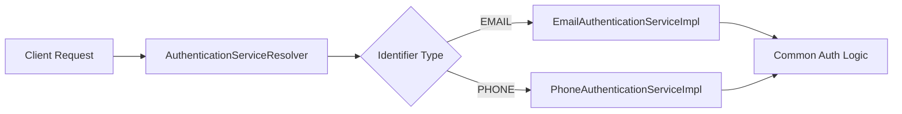
```mermaid
flowchart LR
    A[Client Request] --> B[AuthenticationServiceResolver]
    B --> C{Identifier Type}
    C -->|EMAIL| D[EmailAuthenticationServiceImpl]
    C -->|PHONE| E[PhoneAuthenticationServiceImpl]
    D --> F[Common Auth Logic]
    E --> F
```

#### **Service Resolution Logic**

- **Dynamic Resolution**: Runtime service selection based on an identifier type
- **Validation**: Built-in format validation for email/phone patterns
- **Extensibility**: Easy addition of new identifier types
- **Error Handling**: Clear exceptions for mismatched identifiers

### 6.3.3 Service Responsibilities

#### **AuthenticationServiceResolver**

- **Purpose**: Strategy pattern implementation for identifier-based routing
- **Features**:
    - Format validation (email regex, phone pattern)
    - Service mapping and resolution
    - Type safety and error handling
- **Design Benefit**: Clean separation of channel-specific logic

#### **AuthCommonService**

- **Purpose**: Shared authentication business logic
- **Features**:
    - User lifecycle management
    - Password validation and encoding
    - Common authentication flows
- **Design Benefit**: DRY principle and consistency

#### **OtpService**

- **Purpose**: OTP generation, validation, and delivery
- **Features**:
    - Purpose-scoped OTP generation
    - BCrypt hashing for security
    - Anti-abuse controls
    - Multi-channel delivery
- **Design Benefit**: Centralized OTP management

#### **SessionService**

- **Purpose**: Device-aware session lifecycle management
- **Features**:
    - Session creation and validation
    - Refresh token rotation
    - Device tracking and revocation
    - Security event logging
- **Design Benefit**: Enhanced security and user control

### 6.3.4 External Service Integration

#### **AWS Service Integration**

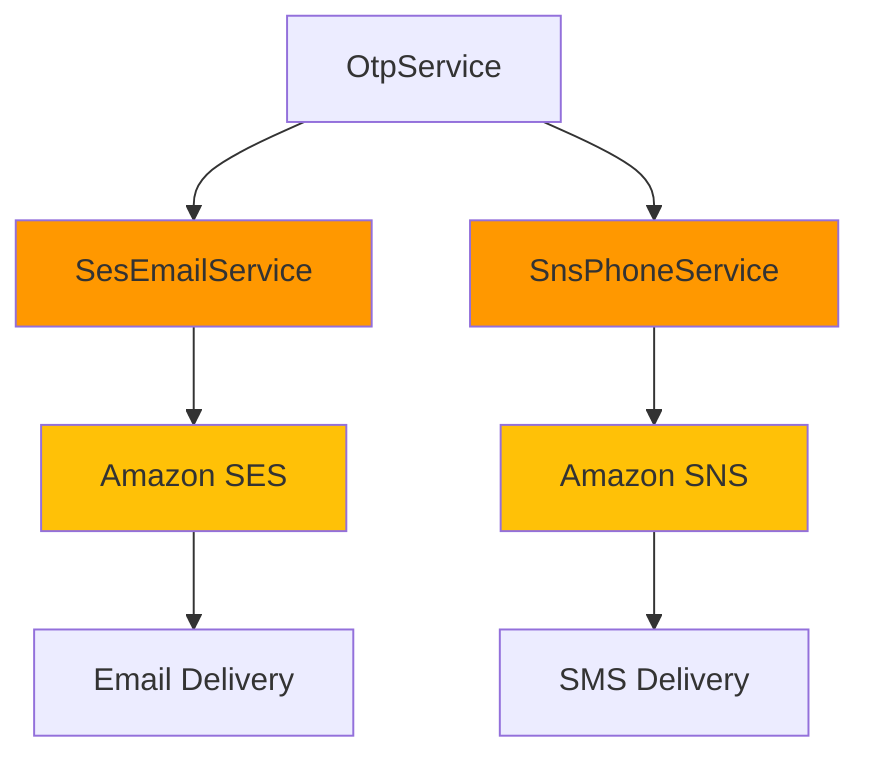
```mermaid
flowchart TD
    A[OtpService] --> B[SesEmailService]
    A --> C[SnsPhoneService]
    B --> D[Amazon SES]
    C --> E[Amazon SNS]
    D --> F[Email Delivery]
    E --> G[SMS Delivery]
    style B fill: #ff9800
    style C fill: #ff9800
    style D fill: #ffc107
    style E fill: #ffc107
```

#### **Configuration Management**

- **Environment-specific**: Configuration comes from `application.yaml` + environment variables
- **Secure Credentials**: AWS config is provided via environment variables (no hardcoding)

### 6.3.5 Infrastructure Services

#### **RateLimitBucketService**

- **Purpose**: Distributed rate limiting via Redis
- **Features**:
    - Token bucket algorithm implementation
    - Redis-based distributed state
    - Configurable policies per endpoint
- **Design Benefit**: Scalable abuse prevention

#### **AuditEventLogger**

- **Purpose**: Structured audit logging
- **Features**:
    - Consistent event schema
    - Structured logging format
    - Security event tracking
- **Design Benefit**: Compliance and debugging support

---

## 6.4) AWS Integration Architecture

The application leverages AWS services for scalable and reliable communication capabilities.

### 6.4.1 AWS Service Integration Diagram

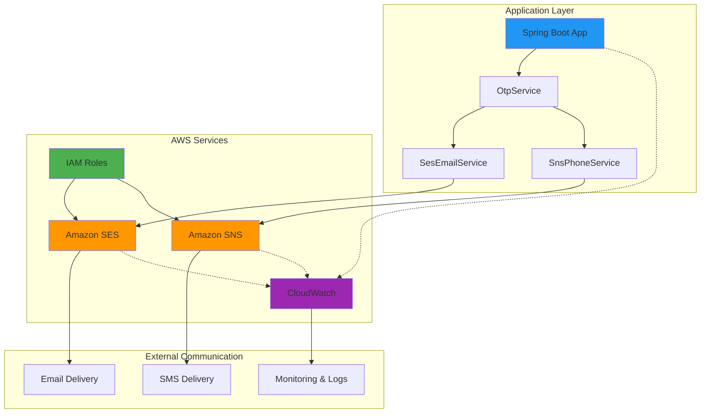
```mermaid
flowchart TB
    subgraph "Application Layer"
        A[Spring Boot App]
        B[OtpService]
        C[SesEmailService]
        D[SnsPhoneService]
    end

    subgraph "AWS Services"
        E[Amazon SES]
        F[Amazon SNS]
        G[IAM Roles]
        H[CloudWatch]
    end

    subgraph "External Communication"
        I[Email Delivery]
        J[SMS Delivery]
        K[Monitoring & Logs]
    end

    A --> B
    B --> C
    B --> D
    C --> E
    D --> F
    E --> I
    F --> J
    A -.-> H
    E -.-> H
    F -.-> H
    H --> K
    G --> E
    G --> F
    style A fill: #2196f3
    style E fill: #ff9800
    style F fill: #ff9800
    style G fill: #4caf50
    style H fill: #9c27b0
```

### 6.4.2 AWS Service Configurations

#### **Amazon SES (Simple Email Service)**

- **Purpose**: Email OTP delivery
- **Features**:
    - Verified sender identity
    - HTML/text email templates
    - Delivery tracking and metrics
    - Bounce/complaint handling
- **Configuration**:
    - Region-specific endpoints
    - Rate limiting quotas
    - DKIM/SPF authentication

#### **Amazon SNS (Simple Notification Service)**

- **Purpose**: SMS OTP delivery
- **Features**:
    - International SMS support
    - Delivery status callbacks
    - Message filtering
    - Cost optimization
- **Configuration**:
    - SMS pricing optimization
    - Country-specific routing
    - Delivery receipts

#### **IAM Security**

- **Purpose**: Secure AWS access
- **Features**:
    - Least privilege principle
    - Service-specific roles
    - Temporary credentials
    - Access logging
- **Best Practices**:
    - No hard-coded credentials
    - Role-based access control
    - Regular credential rotation

### 6.4.3 Error Handling & Resilience

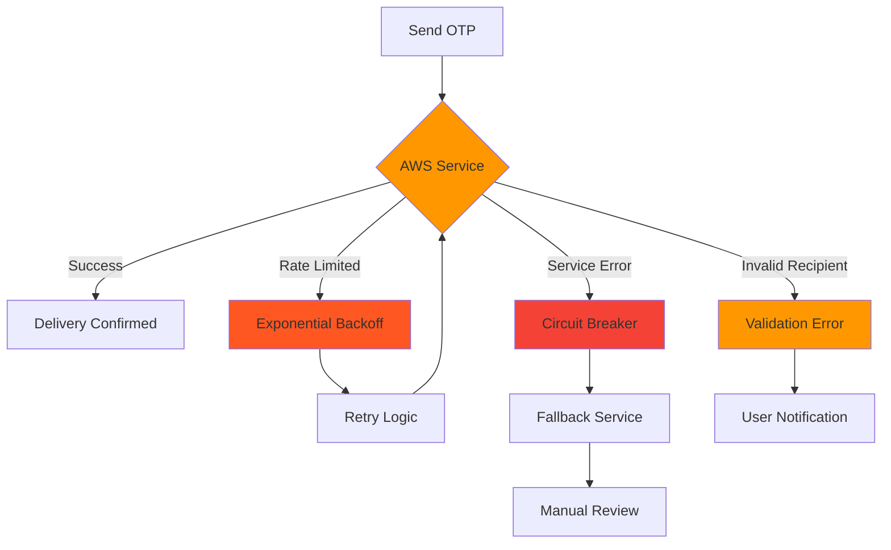
```mermaid
flowchart TD
    A[Send OTP] --> B{AWS Service}
    B -->|Success| C[Delivery Confirmed]
    B -->|Rate Limited| D[Exponential Backoff]
    B -->|Service Error| E[Circuit Breaker]
    B -->|Invalid Recipient| F[Validation Error]
    D --> G[Retry Logic]
    E --> H[Fallback Service]
    F --> I[User Notification]
    G --> B
    H --> J[Manual Review]
    style B fill: #ff9800
    style D fill: #ff5722
    style E fill: #f44336
    style F fill: #ff9800
```

#### **Resilience Notes (what exists today)**

- Delivery failures surface as exceptions from the sender implementation.
- OTP persistence + audit logging and metrics are present around send/verify flows.

### 6.4.4 Monitoring & Observability

#### **CloudWatch Integration**

- **Metrics**: Delivery success rates, latency, error rates
- **Alarms**: Service health, quota utilization
- **Logs**: Structured logging for debugging
- **Dashboards**: Real-time monitoring

#### **Cost Optimization**

- **SMS Optimization**: Country-specific routing
- **Email Optimization**: Bulk sending, template reuse
- **Monitoring**: Usage quotas and alerts
- **Budget Controls**: Cost tracking and alerts

---

## 6.5) Rate Limiting Algorithm Flow

The application implements a sophisticated distributed rate limiting system using the token bucket algorithm.

### 6.5.1 Rate Limiting Flow Diagram

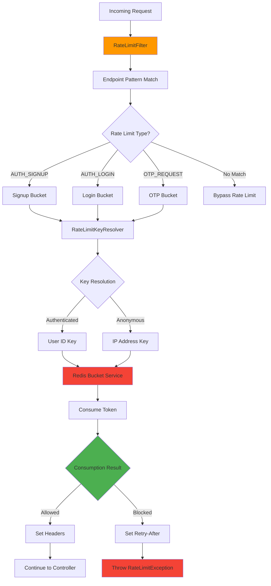
```mermaid
flowchart TD
    A[Incoming Request] --> B[RateLimitFilter]
    B --> C[Endpoint Pattern Match]
    C --> D{Rate Limit Type?}
    D -->|AUTH_SIGNUP| E[Signup Bucket]
    D -->|AUTH_LOGIN| F[Login Bucket]
    D -->|OTP_REQUEST| G[OTP Bucket]
    D -->|No Match| H[Bypass Rate Limit]
    E --> I[RateLimitKeyResolver]
    F --> I
    G --> I
    I --> J{Key Resolution}
    J -->|Authenticated| K[User ID Key]
    J -->|Anonymous| L[IP Address Key]
    K --> M[Redis Bucket Service]
    L --> M
    M --> N[Consume Token]
    N --> O{Consumption Result}
    O -->|Allowed| P[Set Headers]
    O -->|Blocked| Q[Set Retry-After]
    P --> R[Continue to Controller]
    Q --> S[Throw RateLimitException]
    style B fill: #ff9800
    style M fill: #f44336
    style O fill: #4caf50
    style S fill: #f44336
```

### 6.5.2 Token Bucket Algorithm

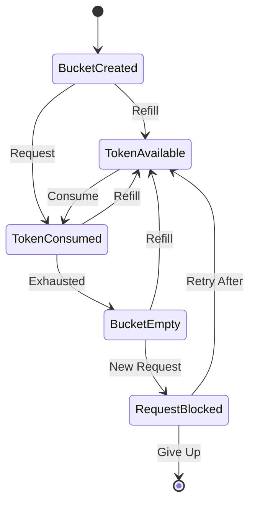
```mermaid
stateDiagram-v2
    [*] --> BucketCreated
    BucketCreated --> TokenAvailable: Refill
    BucketCreated --> TokenConsumed: Request
    TokenAvailable --> TokenConsumed: Consume
    TokenConsumed --> TokenAvailable: Refill
    TokenConsumed --> BucketEmpty: Exhausted
    BucketEmpty --> TokenAvailable: Refill
    BucketEmpty --> RequestBlocked: New Request
    RequestBlocked --> TokenAvailable: Retry After
    RequestBlocked --> [*]: Give Up
```

### 6.5.3 Rate Limiting Configuration

#### **Endpoint-Specific Policies**

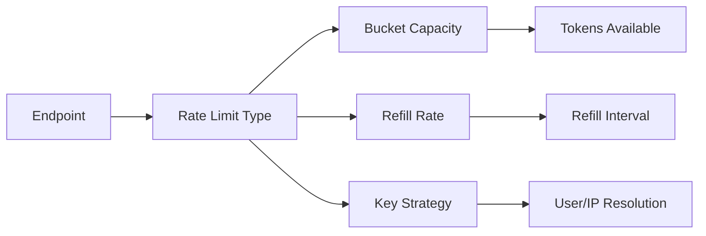
```mermaid
flowchart LR
    A[Endpoint] --> B[Rate Limit Type]
    B --> C[Bucket Capacity]
    B --> D[Refill Rate]
    B --> E[Key Strategy]
    C --> F[Tokens Available]
    D --> G[Refill Interval]
    E --> H[User/IP Resolution]
```

#### **Bucket Configuration Examples**

- **AUTH_SIGNUP**: 5 requests per 15 minutes per IP
- **AUTH_LOGIN**: 10 requests per 5 minutes per user
- **OTP_REQUEST**: 3 requests per hour per identifier
- **SESSION_MANAGE**: 20 requests per minute per user

### 6.5.4 Distributed State Management

#### **Redis Bucket Storage**

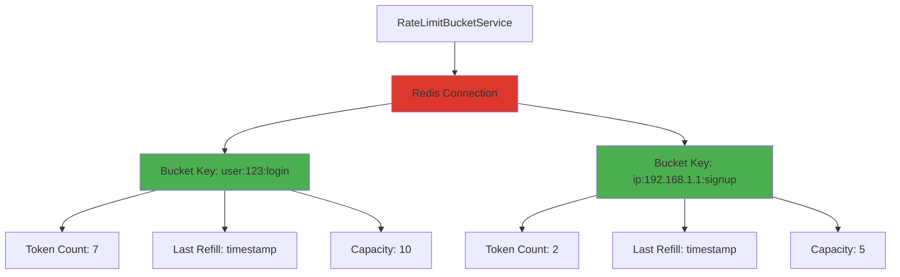
```mermaid
flowchart TD
    A[RateLimitBucketService] --> B[Redis Connection]
    B --> C[Bucket Key: user:123:login]
    B --> D[Bucket Key: ip:192.168.1.1:signup]
    C --> E[Token Count: 7]
    C --> F[Last Refill: timestamp]
    C --> G[Capacity: 10]
    D --> H[Token Count: 2]
    D --> I[Last Refill: timestamp]
    D --> J[Capacity: 5]
    style B fill: #dc382d
    style C fill: #4caf50
    style D fill: #4caf50
```

#### **Key Resolution Strategy**

- **Authenticated Users**: `rate_limit:user:{userId}:{endpointType}`
- **Anonymous Users**: `rate_limit:ip:{clientIp}:{endpointType}`
- **Global Limits**: `rate_limit:global:{endpointType}`

### 6.5.5 Client Experience Features

#### **Response Headers**

- `X-RateLimit-Remaining`: Tokens left in bucket
- `X-RateLimit-Capacity`: Maximum bucket capacity
- `Retry-After`: Seconds until next available token

#### **Frontend Integration**

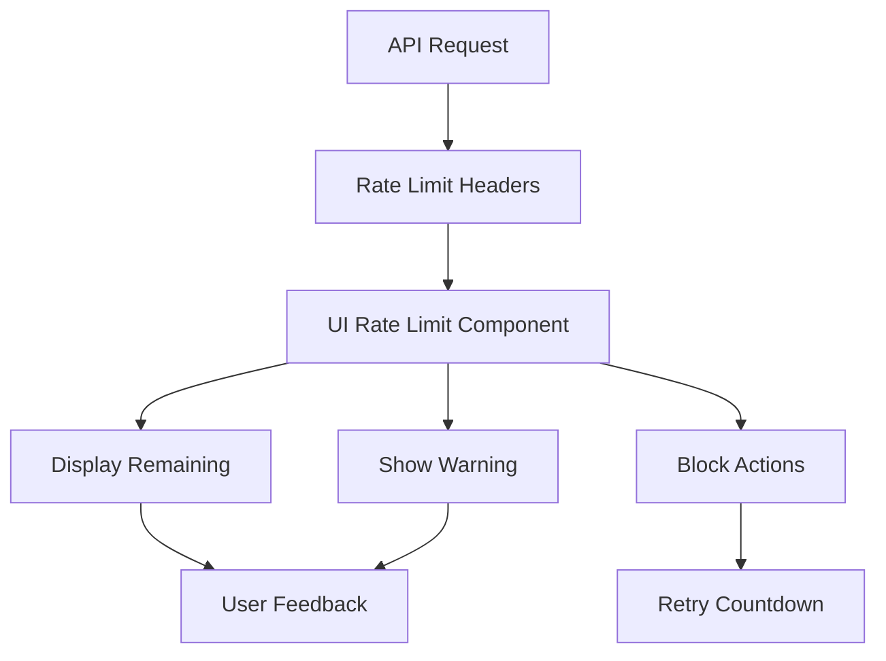
```mermaid
flowchart TD
    A[API Request] --> B[Rate Limit Headers]
    B --> C[UI Rate Limit Component]
    C --> D[Display Remaining]
    C --> E[Show Warning]
    C --> F[Block Actions]
    D --> G[User Feedback]
    E --> G
    F --> H[Retry Countdown]
```

---

## 6.6) Token Lifecycle Management

The application implements a comprehensive JWT token lifecycle with security-first design principles.

### 6.6.1 Token Lifecycle State Diagram

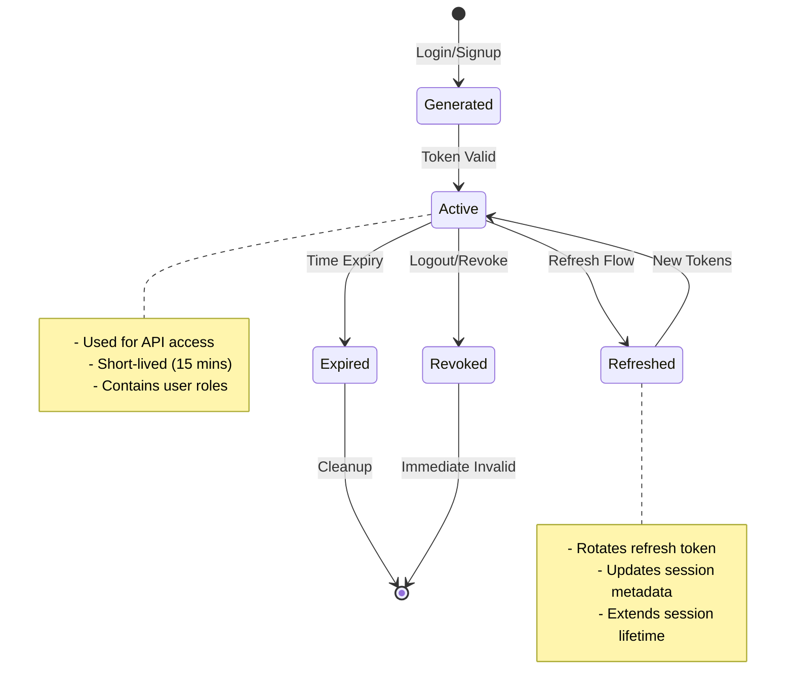
```mermaid
stateDiagram-v2
    [*] --> Generated: Login/Signup
    Generated --> Active: Token Valid
    Active --> Refreshed: Refresh Flow
    Active --> Expired: Time Expiry
    Active --> Revoked: Logout/Revoke
    Refreshed --> Active: New Tokens
    Expired --> [*]: Cleanup
    Revoked --> [*]: Immediate Invalid
    note right of Active
        - Used for API access
        - Short-lived (15 mins)
        - Contains user roles
    end note
    note right of Refreshed
        - Rotates refresh token
        - Updates session metadata
        - Extends session lifetime
    end note
```

### 6.6.2 Token Generation Flow

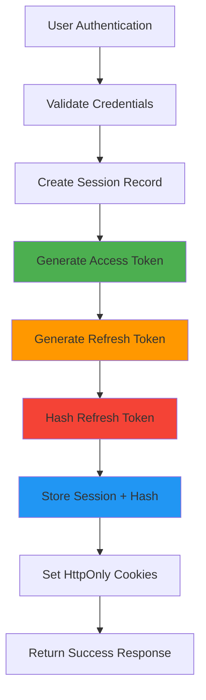
```mermaid
flowchart TD
    A[User Authentication] --> B[Validate Credentials]
    B --> C[Create Session Record]
    C --> D[Generate Access Token]
    D --> E[Generate Refresh Token]
    E --> F[Hash Refresh Token]
    F --> G[Store Session + Hash]
    G --> H[Set HttpOnly Cookies]
    H --> I[Return Success Response]
    style D fill: #4caf50
    style E fill: #ff9800
    style F fill: #f44336
    style G fill: #2196f3
```

### 6.6.3 Token Validation Flow

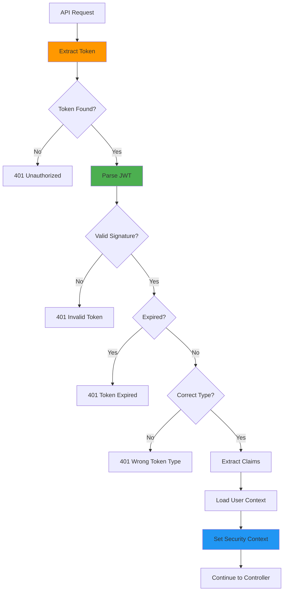
```mermaid
flowchart TD
    A[API Request] --> B[Extract Token]
    B --> C{Token Found?}
    C -->|No| D[401 Unauthorized]
    C -->|Yes| E[Parse JWT]
    E --> F{Valid Signature?}
    F -->|No| G[401 Invalid Token]
    F -->|Yes| H{Expired?}
    H -->|Yes| I[401 Token Expired]
    H -->|No| J{Correct Type?}
    J -->|No| K[401 Wrong Token Type]
    J -->|Yes| L[Extract Claims]
    L --> M[Load User Context]
    M --> N[Set Security Context]
    N --> O[Continue to Controller]
    style B fill: #ff9800
    style E fill: #4caf50
    style N fill: #2196f3
```

### 6.6.4 Refresh Token Rotation

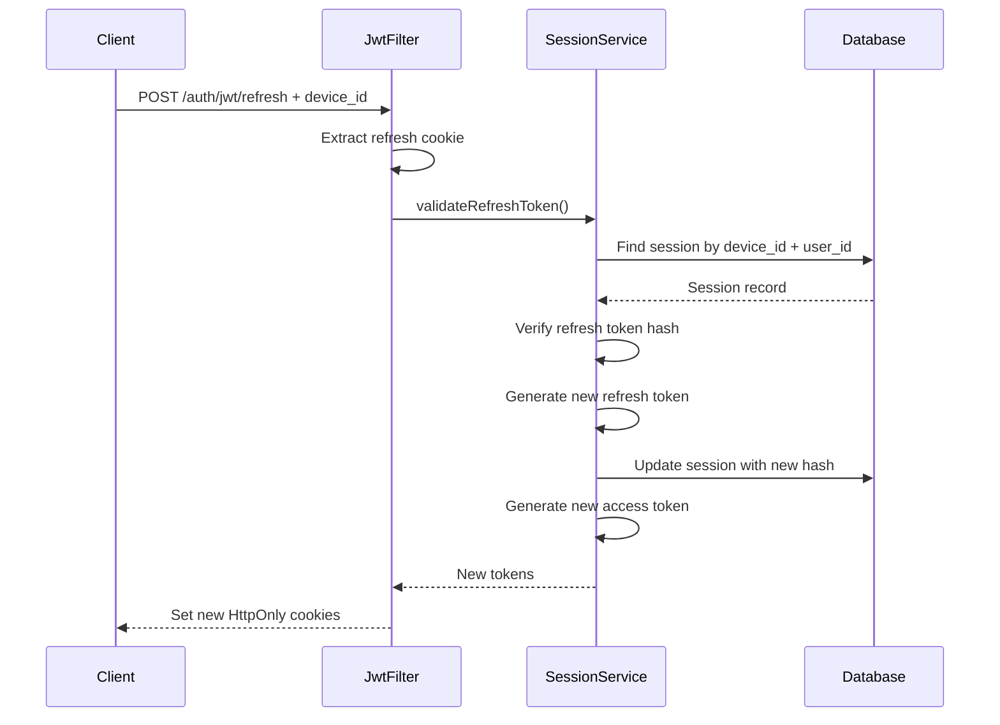
```mermaid
sequenceDiagram
    participant C as Client
    participant F as JwtFilter
    participant S as SessionService
    participant DB as Database
    C ->> F: POST /auth/jwt/refresh + device_id
    F ->> F: Extract refresh cookie
    F ->> S: validateRefreshToken()
    S ->> DB: Find session by device_id + user_id
    DB -->> S: Session record
    S ->> S: Verify refresh token hash
    S ->> S: Generate new refresh token
    S ->> DB: Update session with new hash
    S ->> S: Generate new access token
    S -->> F: New tokens
    F -->> C: Set new HttpOnly cookies
```

### 6.6.5 Session Security Features

#### **Device-Aware Management**

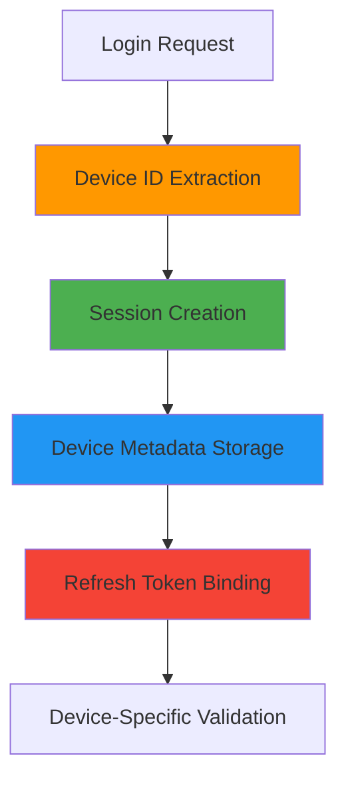
```mermaid
flowchart TD
    A[Login Request] --> B[Device ID Extraction]
    B --> C[Session Creation]
    C --> D[Device Metadata Storage]
    D --> E[Refresh Token Binding]
    E --> F[Device-Specific Validation]
    style B fill: #ff9800
    style C fill: #4caf50
    style D fill: #2196f3
    style E fill: #f44336
```

#### **Multi-Device Support**

- **Device Tracking**: Unique device identifiers
- **Session Isolation**: Independent sessions per device
- **Selective Revocation**: Revoke specific devices
- **Device Limits**: Configurable session limits per user

#### **Security Controls**

- **Token Hashing**: Refresh tokens stored as BCrypt hashes
- **Rotation**: New refresh token on each use
- **Expiration**: Time-based token invalidation
- **Revocation**: Immediate session termination

---

## 6.7) Design Patterns & Architecture Decisions

The application employs several design patterns and architectural decisions to ensure maintainability, scalability, and
security.

### 6.7.1 Design Patterns Implementation

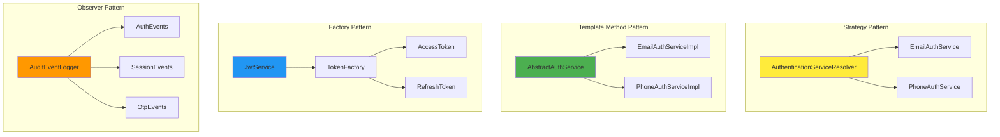
```mermaid
flowchart TD
    subgraph "Strategy Pattern"
        A[AuthenticationServiceResolver]
        A --> B[EmailAuthService]
        A --> C[PhoneAuthService]
    end

    subgraph "Template Method Pattern"
        D[AbstractAuthService]
        D --> E[EmailAuthServiceImpl]
        D --> F[PhoneAuthServiceImpl]
    end

    subgraph "Factory Pattern"
        G[JwtService]
        G --> H[TokenFactory]
        H --> I[AccessToken]
        H --> J[RefreshToken]
    end

    subgraph "Observer Pattern"
        K[AuditEventLogger]
        K --> L[AuthEvents]
        K --> M[SessionEvents]
        K --> N[OtpEvents]
    end

    style A fill: #ffeb3b
    style D fill: #4caf50
    style G fill: #2196f3
    style K fill: #ff9800
```

### 6.7.2 Pattern Descriptions

#### **Strategy Pattern** - Authentication Resolution

- **Implementation**: `AuthenticationServiceResolver`
- **Purpose**: Dynamic service selection based on an identifier type
- **Benefits**:
    - Easy addition of new authentication methods
    - Clean separation of channel-specific logic
    - Runtime service resolution
- **Usage**: Email vs. Phone authentication routing

#### **Template Method Pattern** – Common Auth Flow

- **Implementation**: Abstract base classes with a common flow
- **Purpose**: Standardized authentication steps
- **Benefits**:
    - Consistent user experience
    - Code reuse across channels
    - Enforced security patterns
- **Usage**: Common signup/login validation steps

#### **Factory Pattern** – Token Creation

- **Implementation**: `JwtService` token generation
- **Purpose**: Centralized token creation logic
- **Benefits**:
    - Consistent token structure
    - Easy token type management
    - Centralized validation rules
- **Usage**: Access and refresh token generation

#### **Observer Pattern** - Audit Logging

- **Implementation**: `AuditEventLogger` component
- **Purpose**: Decoupled event tracking
- **Benefits**:
    - Non-intrusive logging
    - Consistent audit format
    - Easy addition of new events
- **Usage**: Security event tracking and compliance

### 6.7.3 Architectural Decisions

#### **Layered Architecture**

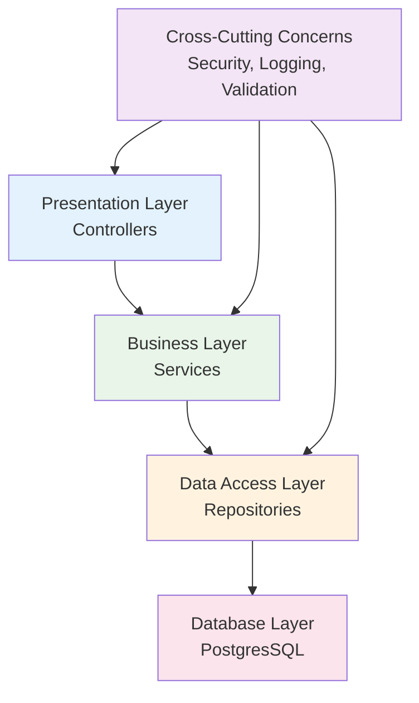
```mermaid
flowchart TD
    A[Presentation Layer<br/>Controllers] --> B[Business Layer<br/>Services]
    B --> C[Data Access Layer<br/>Repositories]
    C --> D[Database Layer<br/>PostgresSQL]
    E[Cross-Cutting Concerns<br/>Security, Logging, Validation] --> A
    E --> B
    E --> C
    style A fill: #e3f2fd
    style B fill: #e8f5e8
    style C fill: #fff3e0
    style D fill: #fce4ec
    style E fill: #f3e5f5
```

#### **Dependency Injection Strategy**

- **Framework**: Spring IoC Container
- **Scope**: Singleton for services, Request for controllers
- **Configuration**: Java-based configuration with @Configuration
- **Benefits**: Loose coupling, easy testing, configuration management

#### **Exception Handling Architecture**

```mermaid
flowchart TD
    A[Business Exception] --> B[Global Exception Handler]
    A --> C[Filter Exception Handler]
    B --> D[Standardized API Response]
    C --> D
    D --> E[Error Code Catalog]
    E --> F[Client-Friendly Messages]
    style B fill: #ff9800
    style C fill: #ff9800
    style D fill: #4caf50
```

### 6.7.4 Security Architecture Decisions

#### **Defense in Depth**

- **Multiple Layers**: Filter → Controller → Service → Repository
- **Fail Secure**: Default deny, explicit allow
- **Least Privilege**: Minimal required permissions
- **Zero Trust**: Validate at every layer

#### **Token Management Strategy**

- **Stateless + Stateful Hybrid**: JWT for authorization, DB for revocation
- **Short-Lived Access**: 15-minute access tokens
- **Refresh Rotation**: New refresh token on each use
- **Secure Storage**: BCrypt hashes for refresh tokens

---

## 6.8) Performance & Scalability Considerations

The application includes several performance-friendly design choices. (This section only lists items that are
implemented in this repository.)

### 6.8.1 Performance-Focused Design Choices

```mermaid
flowchart LR
    A[Stateless API] --> B[JWT auth]
    B --> C[No server sessions]
    D[Redis] --> E[Rate limiting]
    F[DB cleanup] --> G[Scheduled tasks]
```

### 6.8.2 Database Performance

#### **Indexing Strategy**

```mermaid
flowchart LR
    A[Query Patterns] --> B[Index Design]
    B --> C[Unique Indexes]
    B --> D[Composite Indexes]
    B --> E[Partial Indexes]
    C --> F[Email/Phone Uniqueness]
    D --> G[User + Status Queries]
    E --> H[Active Sessions Only]
    style B fill: #ff9800
    style C fill: #4caf50
    style D fill: #2196f3
    style E fill: #9c27b0
```

#### **Query Optimization**

- **N+1 Prevention**: Strategic entity loading
- **Batch Operations**: Bulk updates for cleanup
- **Connection Pooling**: HikariCP configuration
- **Read Replicas**: Query distribution for scaling

#### **Database Scaling Patterns**

```mermaid
flowchart TD
    A[Single Database] --> B[Read Replicas]
    A --> C[Connection Pooling]
    B --> D[Query Distribution]
    C --> E[Concurrency Management]
    D --> F[Horizontal Scaling]
    E --> F
```

### 6.8.2 Redis Usage (Implemented)

- **Rate limiting bucket state**: Bucket4j distributed buckets stored in Redis.
- **No general application caching layer** is implemented.

### 6.8.3 Background Work (Implemented)

- Cleanup is implemented using Spring `@Scheduled` jobs (see `CleanupTask`).

### 6.8.4 Scaling Notes (What the code supports)

- **Stateless HTTP**: `SessionCreationPolicy.STATELESS` allows running multiple instances.
- **Shared rate-limit state**: Redis-backed bucket state works across instances.

### 6.8.6 Performance Monitoring

#### **Key Metrics**

```mermaid
flowchart TD
    A[Performance Metrics] --> B[Response Time]
    A --> C[Throughput]
    A --> D[Error Rate]
    A --> E[Resource Utilization]
    B --> F[API Latency]
    C --> G[Requests/Second]
    D --> H[4xx/5xx Rates]
    E --> I[CPU/Memory/Disk]
    style A fill: #ff9800
    style B fill: #4caf50
    style C fill: #2196f3
    style D fill: #f44336
    style E fill: #9c27b0
```

#### **Performance Testing**

- **Load Testing**: Simulated user traffic
- **Stress Testing**: Breaking point identification
- **Endurance Testing**: Long-running stability
- **Spike Testing**: Traffic burst handling

---

## 7) Visual Flows

### 7.1 Account Lifecycle

```mermaid
flowchart LR
  A[Identifier Status Check] --> B{User Exists?}
  B -- No --> C[Sign Up]
  C --> D[State CREATED]
  D --> E[Request OTP]
  E --> F[Verify OTP]
  F --> G[Complete Sign Up]
  G --> H[State VERIFIED]

  B -- Yes --> I[Login]
  I --> J[Issue Access + Refresh Cookies]
```

### 7.2 Login + Session Creation

```mermaid
sequenceDiagram
  participant Client
  participant API
  participant SessionDB

  Client->>API: POST /auth/identifier/login
  API->>API: Authenticate credentials
  API->>API: Generate access + refresh tokens
  API->>SessionDB: Store hashed refresh token + device metadata
  API-->>Client: Set HttpOnly cookies
```

### 7.3 Refresh Rotation

```mermaid
sequenceDiagram
  participant Client
  participant API
  participant SessionDB

  Client->>API: POST /auth/jwt/refresh + device_id
  API->>API: Extract refresh cookie
  API->>SessionDB: Validate old hash + device + status
  API->>SessionDB: Rotate to new refresh hash
  API->>API: Generate new access token
  API-->>Client: Set new cookies
```

### 7.4 Session Revocation

```mermaid
flowchart TD
  A[Authenticated user] --> B{Action}
  B -->|Revoke one| C[DELETE /sessions/delete/:sessionId]
  B -->|Revoke others| D[POST /sessions/revoke-others]
  C --> E[Target session revoked]
  D --> F[All non-current sessions revoked]
```

### 7.5 OTP Verification Logic

```mermaid
flowchart TD
  A[Verify OTP request] --> B{Expired?}
  B -- Yes --> X1[EXPIRED_OTP]
  B -- No --> C{Attempts exceeded?}
  C -- Yes --> X2[MAX_ATTEMPT_EXCEEDED]
  C -- No --> D{Consumed?}
  D -- Yes --> X3[ALREADY_USED]
  D -- No --> E{Purpose matches?}
  E -- No --> X4[INVALID_PURPOSE]
  E -- Yes --> F{Hash matches?}
  F -- No --> X5[INVALID_OTP]
  F -- Yes --> S[SUCCESS]
```

### 7.6 Rate-Limiting Flow

```mermaid
flowchart TD
  R[Incoming Request] --> M{Endpoint has rate policy?}
  M -- No --> P[Proceed]
  M -- Yes --> K[Resolve key user/ip]
  K --> C[Consume from Redis bucket]
  C --> A{Allowed?}
  A -- Yes --> H[Set X-RateLimit headers + continue]
  A -- No --> X[Set Retry-After + throw rate-limit error]
```

---

## 8) Backend Deep Dive

### 8.1 Authentication strategy routing

The service resolver dispatches authentication logic based on an identifier type.

Benefits:
- clean channel-specific logic,
- easier extension for future identifiers,
- reduced controller complexity.

### 8.2 User lifecycle transition controls

The project uses explicit status transitions instead of ambiguous flags.

This gives:
- stronger state modeling,
- clearer business rules,
- easier testing and interview explanation.

### 8.3 Password and credential handling

- Passwords are encoded before persistence.
- Authentication leverages Spring Security manager.

### 8.4 JWT service responsibilities

JWT service handles:
- token generation,
- claim extraction,
- token expiration checks,
- token type validation,
- refresh access-token issuance.

### 8.5 JWT filter behavior

Filter pipeline:
1. skip public/doc endpoints,
2. extract token (header/cookie),
3. validate claims and token type,
4. map roles to authorities,
5. set Spring security context.

### 8.6 Session service behavior

Core operations include:
- create session,
- validate/rotate session,
- revoke session,
- revoke others,
- list sessions.

### 8.7 OTP service behavior

OTP service does:
- generation,
- hashing,
- persistence,
- send it through the sender interface,
- verify with status-based outcomes.

### 8.8 Cleanup scheduler behavior

Cleanup tasks remove:
- expired OTPs,
- old unverified users,
- expired sessions,
- stale revoked sessions.

---

## 9) Frontend Deep Dive

### 9.1 Auth context lifecycle

Auth context manages:
- startup auth probing,
- local auth state,
- login/logout integration,
- user object persistence.

### 9.2 API service behavior

The API abstraction supports:
- credentialed requests (`credentials: include`),
- refresh-on-401 retry,
- single-flight refresh lock,
- typed error result patterns,
- rate-limit header extraction.

### 9.3 Device identity handling

Frontend generates and persists device ID.
This ID is sent during:
- login,
- refresh,
- logout,
- revoke-others.

### 9.4 Session dashboard

Dashboard capabilities:
- session counters,
- session listing,
- current-device label,
- revoke single,
- revoke others.

### 9.5 Route protection

Protected routes include a loading gate to avoid false redirects while auth is being resolved.

### 9.6 Rate-limit UX

Rate-limit component displays:
- remaining budget,
- low budget warning,
- retry countdown for blocked state.

---

## 10) Security Decisions & Tradeoffs

### 10.1 Why JWT and session table together?

JWT gives stateless authorization checks.
Session table gives revocation and device lifecycle control.

This hybrid model balances:
- scalability,
- control,
- and user security visibility.

### 10.2 Access vs. refresh token split

- Access token: short-lived, used on protected APIs.
- Refresh token: longer-lived, restricted to refresh flow.

This reduces an exposure window and improves UX.

### 10.3 Why HttpOnly cookies?

- Reduces JS token access risk.
- Works naturally with browser credential flows.
- Supports secure cross-origin policy with proper CORS setup.

### 10.4 Why are hash refresh tokens in DB?

- Avoids storing raw long-lived credentials.
- Reduces the blast radius of DB leaks.

### 10.5 Why purpose-scoped OTP?

- Prevents using one OTP across unrelated flows.
- Keeps verification semantics explicit.

### 10.6 Why endpoint-specific throttling?

Different endpoints have different risk profiles.
A single global limit is usually suboptimal for auth systems.

---

## 11) API Overview

Base path: `/api/v1`

### 11.1 Authentication

| Method | Endpoint                            | Description                         |
|--------|-------------------------------------|-------------------------------------|
| POST   | `/auth/identifier/status`           | Get status for identifier           |
| POST   | `/auth/identifier/sign-up`          | Start signup                        |
| POST   | `/auth/identifier/sign-up/complete` | Complete signup                     |
| POST   | `/auth/identifier/login`            | Login and set cookies               |
| POST   | `/auth/jwt/refresh`                 | Rotate refresh and issue new access |
| POST   | `/auth/identifier/logout`           | Revoke current session              |

### 11.2 OTP

| Method | Endpoint             | Description                 |
|--------|----------------------|-----------------------------|
| POST   | `/otp/email/request` | Generate and send email OTP |
| POST   | `/otp/email/verify`  | Verify email OTP            |
| POST   | `/otp/phone/request` | Generate and send phone OTP |
| POST   | `/otp/phone/verify`  | Verify phone OTP            |

### 11.3 Sessions

| Method | Endpoint                       | Description                      |
|--------|--------------------------------|----------------------------------|
| GET    | `/sessions/get/all`            | List sessions for current user   |
| DELETE | `/sessions/delete/{sessionId}` | Revoke one session               |
| POST   | `/sessions/revoke-others`      | Revoke all except current device |

### 11.4 Documentation endpoints

- Swagger UI: `/swagger-ui/index.html`
- OpenAPI JSON: `/v3/api-docs`

---

## 12) Detailed API Payload Examples

### 12.1 Identifier status

```bash
curl -X POST http://localhost:8080/api/v1/auth/identifier/status \
  -H "Content-Type: application/json" \
  -d '{
    "identifier": "intern.candidate@example.com",
    "identifier_type": "EMAIL"
  }'
```

### 12.2 Signup

```bash
curl -X POST http://localhost:8080/api/v1/auth/identifier/sign-up \
  -H "Content-Type: application/json" \
  -d '{
    "identifier": "intern.candidate@example.com",
    "identifier_type": "EMAIL",
    "password": "Intern@123"
  }'
```

### 12.3 Request email OTP

```bash
curl -X POST http://localhost:8080/api/v1/otp/email/request \
  -H "Content-Type: application/json" \
  -d '{
    "email": "intern.candidate@example.com",
    "otp_purpose": "SIGNUP"
  }'
```

### 12.4 Verify email OTP

```bash
curl -X POST http://localhost:8080/api/v1/otp/email/verify \
  -H "Content-Type: application/json" \
  -d '{
    "email": "intern.candidate@example.com",
    "otp": "123456",
    "otp_purpose": "SIGNUP"
  }'
```

### 12.5 Complete signup

```bash
curl -X POST http://localhost:8080/api/v1/auth/identifier/sign-up/complete \
  -H "Content-Type: application/json" \
  -d '{
    "identifier": "intern.candidate@example.com",
    "identifier_type": "EMAIL"
  }'
```

### 12.6 Login

```bash
curl -X POST http://localhost:8080/api/v1/auth/identifier/login \
  -H "Content-Type: application/json" \
  -d '{
    "identifier": "intern.candidate@example.com",
    "password": "Intern@123",
    "device_id": "web-chrome-macos"
  }' \
  -c cookies.txt
```

### 12.7 Refresh

```bash
curl -X POST http://localhost:8080/api/v1/auth/jwt/refresh \
  -H "Content-Type: application/json" \
  -d '{
    "device_id": "web-chrome-macos"
  }' \
  -b cookies.txt -c cookies.txt
```

### 12.8 Sessions list

```bash
curl -X GET http://localhost:8080/api/v1/sessions/get/all \
  -b cookies.txt
```

### 12.9 Revoke session by id

```bash
curl -X DELETE "http://localhost:8080/api/v1/sessions/delete/<session-uuid>" \
  -b cookies.txt
```

### 12.10 Revoke others

```bash
curl -X POST http://localhost:8080/api/v1/sessions/revoke-others \
  -H "Content-Type: application/json" \
  -d '{
    "device_id": "web-chrome-macos"
  }' \
  -b cookies.txt
```

---

## 13) Data Model Overview

### 13.1 AppUser

Representative attributes:
- identifier fields (email/phone),
- password hash,
- lifecycle status,
- verification flags,
- failed attempts / lock metadata,
- role assignments,
- session relation.

### 13.2 Session

Representative attributes:
- refresh token hash,
- device + IP + UA metadata,
- expiry + last-used timestamps,
- revoke status.

### 13.3 OtpToken

Representative attributes:
- identifier + type,
- purpose,
- hashed OTP,
- created/sent/expiry times,
- attempts,
- consumed + verified timestamps,
- optimistic lock version.

### 13.4 Role/Permission

- role assignment supports authorization mapping.
- role names are added to JWT access claims.

---

## 14) Error Handling & API Contract

### 14.1 API response envelope

Both success and failure responses are returned using a consistent envelope.

### 14.2 Business exception mapping

Business exceptions are translated by global exception handler into predictable response payloads.

### 14.3 Error code catalog

Error codes are centralized and typed via enum to ensure stable API behavior.

### 14.4 Validation error structure

Validation errors include field-level detail, so frontend can render actionable feedback.

### 14.5 Interview angle

A stable contract between frontend/backend is a major quality signal in team environments.

---

## 15) Rate Limiting & Abuse Prevention

### 15.1 Endpoint mapping

Endpoints are mapped to rate-limit types in config.

### 15.2 Bucket rules

Rules define:
- burst capacity,
- refill tokens,
- refill duration.

### 15.3 Distributed state

Redis stores bucket state for consistent enforcement across instances.

### 15.4 Key resolver

Resolver prefers authenticated user identity, otherwise falls back to client IP.

### 15.5 UX headers

Filter returns limit headers and retry guidance.

### 15.6 OTP anti-abuse

OTP layer has separate cooldown/window controls in addition to request-level rate limits.

---

## 16) Observability & Operations

### 16.1 Management endpoints

Actuator endpoints expose health and metrics.

### 16.2 Metrics

Prometheus export is enabled.
Type tags rate-limit counters.

### 16.3 Logging

Important auth/session transitions are logged for diagnostics.

### 16.4 Scheduled cleanup

Cleanup tasks keep OTP/session tables healthy and remove stale records.

### 16.5 Operations value

These controls reduce long-term data growth and improve runtime maintainability.

### 16.6 Database migrations (Flyway)

- Schema changes are versioned and applied automatically at startup using Flyway.
- Migration scripts are stored in `src/main/resources/db/migration`.
- Naming convention follows Flyway defaults: `V<version>__<description>.sql`
  (example: `V1__init.sql`, `V2__added_column_nickname.sql`).
- `spring.flyway.baseline-on-migrate=true` is enabled for smoother adoption on existing environments.
- Keep migrations immutable once committed; add a new versioned script for any change.

---

## 16.1) EC2 Cron Jobs for Image Cleanup

### 16.1.1 Overview

The application runs automated cleanup jobs on EC2 instances to maintain system hygiene and prevent resource exhaustion.
These cron jobs are configured to run during off-peak hours (3:00 AM) to minimize impact on user experience.

### 16.1.2 Cleanup Schedule

Runs daily at **03:00 AM** (server time) on the EC2 host.

### 16.1.3 Cleanup Operations

#### **Docker System Prune**

- **Schedule**: Daily at 3:00 AM
- **Purpose**: Remove unused Docker resources
- **Scope**:
    - Stopped containers
    - Unused networks
    - Dangling images
    - Unused build cache
    - Anonymous volumes (with --volumes flag)
- **Impact**: Frees significant disk space and improves container startup performance

#### **Image Prune with Age Filter**

- **Schedule**: Daily at 3:00 AM
- **Purpose**: Remove old Docker images older than 72 hours
- **Filter**: `--filter "until=72h"`
- **Retention**: Keeps recent images for potential rollbacks
- **Impact**: Prevents image bloat while maintaining operational safety

#### **Volume Prune**

- **Schedule**: Daily at 3:00 AM
- **Purpose**: Remove unused Docker volumes
- **Safety**: Only removes volumes not attached to any container
- **Impact**: Recovers storage from orphaned volumes

### 16.1.4 Notes

- The CI/CD workflow deploys the backend container to EC2 (see `.github/workflows/CI-CD.yaml`).
- The cron job itself is configured on the EC2 host (outside this repository).

### 16.1.5 Benefits

1. **Storage Optimization**: Prevents disk space exhaustion on long-running instances
2. **Performance Improvement**: Faster container startup with cleaner image cache
3. **Cost Management**: Reduces EBS volume usage and associated costs
4. **Operational Stability**: Automated maintenance reduces manual intervention
5. **Security Hygiene**: Removes potentially vulnerable old images

### 16.1.6 Troubleshooting

#### **Common Issues**

- **Insufficient permissions**: Ensure cron user has Docker daemon access
- **Disk still full**: Check for large application logs or database files
- **Container restart failures**: Verify required images aren't being pruned

#### **Manual Cleanup Commands**

```bash
# Emergency manual cleanup
docker system df                    # Check usage
docker system prune -af --volumes  # Aggressive cleanup
docker image ls --filter "dangling=true"  # Check dangling images
```

#### **Monitoring Commands**

```bash
# Monitor cleanup effectiveness
df -h                              # Disk usage
docker system df                    # Docker usage
tail -f /var/log/docker-cleanup.log # Cleanup logs
```

This automated cleanup strategy ensures the EC2 instances maintain optimal performance and storage efficiency without
requiring manual intervention.

---

## 16.2) Testing Architecture

The application implements a comprehensive testing strategy with multiple test layers and specialized testing patterns.

### 16.2.1 Testing Pyramid (What exists in this repo)

```mermaid
flowchart TB
    A[Unit tests] --> B[Service tests]
    B --> C[Integration tests IT]
    C --> D[Redis/Postgres via Testcontainers]
```

### 16.2.2 Test Layer Breakdown

#### **Unit Tests** (Foundation Layer)

- **Purpose**: Test individual components in isolation
- **Coverage**: Business logic, utility functions, data transformations
- **Tools**: JUnit 5, Mockito
- **Examples**:
    - Service method logic validation
    - Utility function correctness
    - Entity validation rules
    - Password encoding/decoding

#### **Component Tests** (Spring Context)

- **Purpose**: Test Spring components with mocked dependencies
- **Coverage**: Individual controllers, services, repositories
- **Tools**: Spring Boot Test, @WebMvcTest, @DataJpaTest
- **Examples**:
    - Controller endpoint validation
    - Service dependency injection
    - Repository query methods

#### **Integration Tests** (Full Stack)

- **Purpose**: Test component interactions with real infrastructure
- **Coverage**: API endpoints, database operations, external services
- **Tools**: Testcontainers,@SpringBootTest
- **Examples**:
    - Complete authentication flows
    - Database transaction handling
    - Redis rate limiting integration

#### **End-to-End Tests**

- Not present in this repository.

### 16.2.3 Security Testing Architecture

```mermaid
flowchart TD
    subgraph "Security Test Types"
        A[Authentication Tests]
        B[Authorization Tests]
        C[Rate Limiting Tests]
        D[Input Validation Tests]
    end

    subgraph "Test Scenarios"
        E[Valid Credentials]
        F[Invalid Tokens]
        G[Rate Limit Bypass]
        H[SQL Injection]
        I[XSS Prevention]
        J[CSRF Protection]
    end

    A --> E
    A --> F
    B --> E
    B --> F
    C --> G
    D --> H
    D --> I
    D --> J
    style A fill: #f44336
    style B fill: #ff9800
    style C fill: #4caf50
    style D fill: #2196f3
```

#### **Security Test Coverage**

- **JWT Token Validation**: Expired, invalid, malformed tokens
- **Authorization**: Role-based access control testing
- **Rate Limiting**: Boundary testing and bypass attempts
- **Input Validation**: SQL injection, XSS, CSRF prevention
- **Session Security**: Token rotation, device management

### 16.2.4 Test Data Management

#### **Test Data Strategy**

```mermaid
flowchart LR
    A[Test Data Setup] --> B[In-Memory DB]
    A --> C[Testcontainers]
    A --> D[Mock Services]
    B --> E[H2 Database]
    C --> F[PostgresSQL]
    C --> G[Redis]
    D --> H[AWS Services]
    style A fill: #ff9800
    style B fill: #4caf50
    style C fill: #2196f3
    style D fill: #9c27b0
```

#### **Data Isolation**

- **Test Databases**: Separate schemas per test suite
- **Transaction Rollback**: Clean state after each test
- **Mock Data**: Consistent test data fixtures
- **Environment Variables**: Test-specific configurations

### 16.2.5 Performance Testing

- Dedicated load/stress testing tooling is not included in this repository.

### 16.2.6 Test Automation & CI/CD

#### **Continuous Testing Pipeline**

```mermaid
flowchart LR
    A[Code Commit] --> B[Unit Tests]
    B --> C[Integration Tests]
    C --> D[Security Tests]
    D --> E[Performance Tests]
    E --> F[Deployment]
    B -->|Fail| G[Block PR]
    C -->|Fail| G
    D -->|Fail| G
    E -->|Fail| G
    style A fill: #2196f3
    style B fill: #4caf50
    style C fill: #ff9800
    style D fill: #f44336
    style E fill: #9c27b0
    style G fill: #ff5722
```

#### **Quality Gates**

- CI runs unit/integration tests (see GitHub Actions workflow).

---

## 16.3) Monitoring & Observability Deep Dive

This repository includes Actuator + Prometheus metrics export and structured audit logging.

### 16.3.1 Observability Stack Architecture

```mermaid
flowchart LR
    A[Spring Boot] --> B[Micrometer]
    B --> C[/actuator/prometheus/]
    A --> D[AuditEventLogger]
    A --> E[/actuator/health/]
```

### 16.3.2 Metrics Architecture

#### **Business Metrics**

```mermaid
flowchart TD
    A[Authentication Events] --> B[Login Success Rate]
    A --> C[Signup Conversion]
    A --> D[OTP Verification Rate]
    E[Session Management] --> F[Active Sessions]
    E --> G[Session Duration]
    E --> H[Multi-Device Usage]
    I[Security Events] --> J[Failed Login Attempts]
    I --> K[Rate Limit Blocks]
    I --> L[Token Revocations]
    style A fill: #4caf50
    style E fill: #ff9800
    style I fill: #f44336
```

#### **Technical Metrics**

- **Application Metrics**: JVM memory, CPU usage, thread pools
- **Database Metrics**: Connection pool usage, query performance
- **Redis Metrics**: Connection count, memory usage, hit rates
- **HTTP Metrics**: Request rates, response times, error rates

#### **Custom Metrics (actually used in code)**

```yaml
auth.login.success: Counter
auth.login.failure: Counter
auth.refresh.success: Counter
auth.refresh.failure: Counter
auth.otp.request.success: Counter
auth.otp.request.failure: Counter
auth.otp.verify.success: Counter
auth.otp.verify.failure: Counter

rate_limit.success{type=...}: Counter
rate_limit.blocked{type=...}: Counter
```

### 16.3.3 Logging Architecture

#### **Structured Logging Schema**

```mermaid
flowchart TD
    A[Log Event] --> B[Timestamp]
    A --> C[Log Level]
    A --> D[Service Name]
    A --> E[Request ID]
    A --> F[User ID]
    A --> G[Event Type]
    A --> H[Message]
    A --> I[Context]
    style A fill: #ff9800
    style B fill: #4caf50
    style C fill: #2196f3
    style G fill: #f44336
```

#### **Audit Event Schema**

```json
{
  "timestamp": "2026-02-28T02:17:00Z",
  "level": "INFO",
  "service": "dragon-of-north",
  "request_id": "req_123456",
  "user_id": "user_789",
  "device_id": "device_456",
  "event": "LOGIN_SUCCESS",
  "ip_address": "192.168.1.100",
  "user_agent": "Mozilla/5.0...",
  "result": "SUCCESS",
  "reason": "Valid credentials",
  "duration_ms": 150
}
```

#### **Log Levels & Usage**

- **ERROR**: System failures, security breaches
- **WARN**: Performance issues, rate limiting
- **INFO**: Business events, state changes
- **DEBUG**: Detailed execution flow
- **TRACE**: Fine-grained debugging

### 16.3.4 Distributed Tracing

- Not implemented in this repository.

### 16.3.5 Health Check Architecture

#### **Health Check Hierarchy**

```mermaid
flowchart TD
    A[Health Check] --> B[Application Health]
    A --> C[Database Health]
    A --> D[Redis Health]
    A --> E[External Service Health]
    B --> F[Startup Check]
    B --> G[Readiness Check]
    B --> H[Liveness Check]
    C --> I[Connection Pool]
    C --> J[Query Performance]
    D --> K[Redis Connection]
    D --> L[Memory Usage]
    E --> M[AWS SES]
    E --> N[AWS SNS]
    style A fill: #ff9800
    style B fill: #4caf50
    style C fill: #2196f3
    style D fill: #9c27b0
    style E fill: #f44336
```

#### **Health Check Endpoints**

- `/actuator/health`: Overall application health
- `/actuator/health/readiness`: Readiness probe
- `/actuator/health/liveness`: Liveness probe
- `/actuator/health/db`: Database connectivity
- `/actuator/health/redis`: Redis connectivity

### 16.3.6 Alerting Strategy

- Alerting integrations are not defined in this repository.

### 16.3.7 Dashboards

- Dashboards (Grafana/Kibana) are not included in this repository.

---

## 17) Testing Strategy

### 17.1 Test layers present

- controller tests,
- service tests,
- repository tests,
- security/filter tests,
- rate-limit tests,
- integration tests.

### 17.2 What is validated

- auth status/signup/complete flows,
- OTP behavior,
- JWT parsing/filter behavior,
- session service operations,
- exception mapping,
- rate-limit path behavior.

### 17.3 Run tests

```bash
./mvnw test
```

Alternative:

```bash
mvn test
```

### 17.4 Integration test note

Integration tests rely on Testcontainers and are best run with Docker available.

---

## 18) Local Development Setup

### 18.1 Clone repository

```bash
git clone https://github.com/Vinay2080/dragon-of-north.git
cd dragon-of-north
```

### 18.2 Environment setup

Create `.env` in project root using keys referenced in `application.yaml`.

#### Database variables
- `db_name`
- `db_url`
- `db_port`
- `db_username`
- `db_password`

> Note: The project uses Flyway for schema evolution. Keep `db_ddl_auto` conservative in shared environments
> (typically `validate`), and make schema changes through versioned migration scripts.

#### JWT variables
- `access_token`
- `refresh_token`
- `public_key_path`
- `private_key_path`

#### Redis variables
- `redis_host`
- `redis_password`

#### OTP variables
- `otp_length`
- `otp_ttl_minutes`
- `otp_max_verify_attempts`
- `otp_request_window_seconds`
- `otp_block_duration_minutes`
- `otp_resend_cooldown_seconds`
- `otp_max_requests_per_window`
- `otp_cleanup_delay_ms`

#### Auth throttle variables
- `auth_signup_request_window_seconds`
- `auth_signup_max_requests_per_window`
- `auth_signup_block_duration_minutes`
- `auth_login_max_failed_attempts`
- `auth_login_block_duration_minutes`

#### AWS variables
- `aws_region`
- `aws_ses_sender`

### 18.3 Run backend

```bash
./mvnw spring-boot:run
```

On startup, Flyway will automatically apply pending migrations before the application becomes ready.

### 18.4 Run frontend

```bash
cd frontend
npm install
npm run dev
```

### 18.5 Useful URLs

- API: `http://localhost:8080`
- Swagger: `http://localhost:8080/swagger-ui/index.html`
- Frontend: `http://localhost:5173`

---

## 19) Deployment Notes

### 19.1 Backend deployment

- Use Dockerfile for container builds.
- Supply environment variables securely.
- Enforce HTTPS in production.

### 19.2 Frontend deployment

- Build and deploy static assets.
- Align CORS and cookie settings with deployed domains.

### 19.3 Production checklist

- rotate signing keys periodically,
- monitor auth error rates,
- tune rate-limit thresholds,
- tighten CORS allowlist,
- configure operational alerts.

---

## 20) Key points to note.

### 20.1 One-minute project pitch

> Dragon of North is a production-style auth platform where I implemented identifier-based signup/login, purpose-scoped OTP verification, JWT access/refresh lifecycle, and device-aware session revocation. I chose HttpOnly cookies, refresh rotation, and hashed refresh-token persistence to improve security. I also implemented distributed rate limiting using Redis + Bucket4j and standardized error contracts for frontend stability.

### 20.2 Key architecture points to explain

1. Why hybrid JWT and session persistence are used.
2. How refresh-token rotation is enforced.
3. How device ID enables targeted revocation.
4. Why enum-driven states improve correctness.
5. How rate-limit headers improve UX.

### 20.3 Some of the very few questions I asked myself while building a project.

**Q: Why not only JWT and no session table?**  
A: JWT provides stateless auth checks, but a session table is needed for revocation/device visibility/rotation controls.

**Q: How do you reduce token theft risk?**  
A: Short-lived access token, HttpOnly cookies, refresh rotation, and hash-at-rest storage.

**Q: How do you prevent OTP abuse?**  
A: OTP cooldown + request windows + attempt limits + distributed endpoint throttling.

**Q: How does frontend handle access expiry?**  
A: refresh-on-401 with a single-flight refresh lock and one retry.

### 20.4 Suggested live demo order

1. Identifier status check
2. Signup
3. OTP request + verify
4. Signup completes
5. Login
6. Session list
7. Refresh
8. Revoke others
9. Trigger rate-limited response

### 20.5 Summary in short

- Built a secure authentication platform with JWT access/refresh lifecycle, HttpOnly cookie transport, and refresh token rotation.
- Implemented device-aware session management with per-device metadata and revoke controls.
- Developed purpose-scoped OTP service with BCrypt hash-at-rest and anti-abuse protections.
- Added Redis + Bucket4j distributed rate limiting and surfaced quota headers for client UX.
- Standardized API error contracts via global exception handling and enum-based error codes.

---

## 21) What to Improve Next

### 21.1 Security hardening ideas

- refresh token reuse detection,
- richer anomaly detection on login behavior,
- optional stronger device-fingerprint scoring.

### 21.2 API expansion ideas

- admin session visibility/revocation,
- pagination/filtering on sessions,
- richer audit event endpoints.

### 21.3 Frontend improvements

- dedicated manage-sessions route/page refinements,
- stronger error reason rendering by backend code,
- optimistic UI enhancements for revoke operations.

### 21.4 Ops improvements

- dashboard/alerts for auth anomaly metrics,
- structured audit stream,
- policy-driven alerting thresholds.

---

## 22) Project Structure

```text
src
├── main
│   ├── java
│   │   └── org
│   │       └── miniProjectTwo
│   │           └── DragonOfNorth
│   │               ├── DragonOfNorthApplication.java
│   │               ├── components
│   │               │   └── TokenHasher.java
│   │               ├── config
│   │               │   ├── AuditorAwareImpl.java
│   │               │   ├── BeansConfig.java
│   │               │   ├── JpaConfig.java
│   │               │   ├── OpenApiConfig.java
│   │               │   ├── OtpConfig
│   │               │   │   ├── SesConfig.java
│   │               │   │   └── SnsConfig.java
│   │               │   ├── RateLimitConfig.java
│   │               │   ├── RateLimitProperties.java
│   │               │   ├── initializer
│   │               │   │   ├── RolesInitializer.java
│   │               │   │   └── TestDataInitializer.java
│   │               │   └── security
│   │               │       ├── AppUserDetails.java
│   │               │       ├── CorsConfig.java
│   │               │       ├── JwtFilter.java
│   │               │       ├── JwtServicesImpl.java
│   │               │       ├── KeyUtils.java
│   │               │       └── SecurityConfig.java
│   │               ├── controller
│   │               │   ├── AuthenticationController.java
│   │               │   ├── OtpController.java
│   │               │   └── SessionController.java
│   │               ├── dto
│   │               │   ├── api
│   │               │   │   ├── ApiResponse.java
│   │               │   │   └── ErrorResponse.java
│   │               │   ├── auth
│   │               │   │   ├── request
│   │               │   │   │   ├── AppUserLoginRequest.java
│   │               │   │   │   ├── AppUserSignUpCompleteRequest.java
│   │               │   │   │   ├── AppUserSignUpRequest.java
│   │               │   │   │   ├── AppUserStatusFinderRequest.java
│   │               │   │   │   └── DeviceIdRequest.java
│   │               │   │   └── response
│   │               │   │       └── AppUserStatusFinderResponse.java
│   │               │   ├── otp
│   │               │   │   └── request
│   │               │   │       ├── EmailOtpRequest.java
│   │               │   │       ├── EmailVerifyRequest.java
│   │               │   │       ├── PhoneOtpRequest.java
│   │               │   │       └── PhoneVerifyRequest.java
│   │               │   ├── package-info.java
│   │               │   └── session
│   │               │       └── response
│   │               │           └── SessionSummaryResponse.java
│   │               ├── enums
│   │               │   ├── ApiResponseStatus.java
│   │               │   ├── AppUserStatus.java
│   │               │   ├── ErrorCode.java
│   │               │   ├── IdentifierType.java
│   │               │   ├── OtpPurpose.java
│   │               │   ├── OtpVerificationStatus.java
│   │               │   ├── RateLimitType.java
│   │               │   └── RoleName.java
│   │               ├── exception
│   │               │   ├── ApplicationExceptionHandler.java
│   │               │   ├── BusinessException.java
│   │               │   └── ExceptionHandlerFilter.java
│   │               ├── model
│   │               │   ├── AppUser.java
│   │               │   ├── BaseEntity.java
│   │               │   ├── OtpToken.java
│   │               │   ├── Permission.java
│   │               │   ├── Role.java
│   │               │   └── Session.java
│   │               ├── ratelimit
│   │               │   ├── RateLimitBucketServiceImpl.java
│   │               │   └── RateLimitFilter.java
│   │               ├── repositories
│   │               │   ├── AppUserRepository.java
│   │               │   ├── OtpTokenRepository.java
│   │               │   ├── RoleRepository.java
│   │               │   └── SessionRepository.java
│   │               ├── resolver
│   │               │   ├── AuthenticationServiceResolver.java
│   │               │   └── RateLimitKeyResolver.java
│   │               ├── serviceInterfaces
│   │               │   ├── AuthCommonServices.java
│   │               │   ├── AuthenticationService.java
│   │               │   ├── JwtServices.java
│   │               │   ├── OtpSender.java
│   │               │   ├── OtpService.java
│   │               │   ├── RateLimitBucketService.java
│   │               │   └── SessionService.java
│   │               └── services
│   │                   ├── AppUserDetailService.java
│   │                   ├── CleanupTask.java
│   │                   ├── auth
│   │                   │   ├── AuthCommonServiceImpl.java
│   │                   │   ├── EmailAuthenticationServiceImpl.java
│   │                   │   ├── PhoneAuthenticationServiceImpl.java
│   │                   │   └── SessionServiceImpl.java
│   │                   ├── otp
│   │                   │   ├── EmailOtpSender.java
│   │                   │   ├── OtpServiceImpl.java
│   │                   │   ├── PhoneOtpSender.java
│   │                   │   └── SesEmailService.java
│   │                   └── package-info.java
│   └── resources
│       ├── META-INF
│       │   └── additional-spring-configuration-metadata.json
│       └── application.yaml

## 23) License

MIT

---

## Appendix A: Extended Endpoint Notes

### Authentication endpoints

- `/auth/identifier/status`: used to determine UI path.
- `/auth/identifier/sign-up`: creates user in `CREATED`.
- `/auth/identifier/sign-up/complete`: finalizes `VERIFIED` transition.
- `/auth/identifier/login`: validates credentials and sets auth cookies.
- `/auth/jwt/refresh`: rotates refresh state and refreshes access token.
- `/auth/identifier/logout`: revokes current session and clears cookies.

### OTP endpoints

- request endpoints generate purpose-scoped OTP tokens.
- verify endpoints return explicit status enums.

### Session endpoints

- list sessions for current user,
- revoke one by session ID,
- revoke all except current device.

---

## Appendix B: Feature Checklist

### Authentication
- [x] Email and phone identifier support
- [x] Status endpoint
- [x] Signup and signup completion
- [x] Login and logout

### JWT & Session
- [x] Access/refresh token split
- [x] Token type validation
- [x] JWT roles claim mapping
- [x] Session creation and listing
- [x] Session revoke one / revoke others
- [x] Refresh token hash storage
- [x] Refresh token rotation

### OTP
- [x] Email OTP request/verify
- [x] Phone OTP request/verify
- [x] Purpose-based OTP validation
- [x] Attempt + expiry + consumed checks
- [x] OTP anti-abuse controls

### Abuse prevention
- [x] Endpoint-specific rate limiting
- [x] Redis distributed bucket state
- [x] Quota/retry headers

### API quality
- [x] Global exception mapping
- [x] Error code enum catalog
- [x] DTO validation
- [x] OpenAPI docs

### Frontend
- [x] Auth context
- [x] Refresh-on-401 single-flight retry
- [x] Protected routes
- [x] Session dashboard actions
- [x] Rate-limit UI

### Operations
- [x] Actuator + Prometheus
- [x] Cleanup tasks
- [x] Dockerfile

---

## Appendix C: Topics focused while building this project

1. **Security design** (not just endpoint count)
2. **Lifecycle modeling** (user, token, OTP, session)
3. **Abuse prevention strategy** (rate limits + OTP controls)
4. **Frontend/backend coordination** (device id + cookie model)
5. **Maintainability patterns** (enums, global error mapping, layered architecture)

This framing makes your project sound like real engineering work instead of a tutorial clone.
