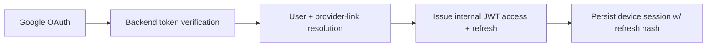

# Dragon of North

Production-grade identity platform built with Spring Boot + React, designed to demonstrate **mature auth architecture** rather than feature demos.

## Architecture at a Glance

**Core decision:** use stateless JWTs for API performance, but bind refresh behavior to a persisted session record for revocation, device controls, and incident response.

- **Local auth:** email/phone + password.
- **Federated auth:** Google OAuth 2.0 Authorization Code flow (backend token verification + account linking).
- **Token model:** short-lived access token + rotating refresh token.
- **Session model:** refresh token hash stored per device/session row.
- **Operational posture:** Flyway migrations, structured audit logs, Micrometer metrics, Redis rate limits, integration tests via Testcontainers.

---

## Engineering Decisions & Tradeoffs

### 1) Hybrid JWT + Session-Table Model

**Why:** JWT-only is fast but weak at server-side revocation. Session-only is controllable but adds DB lookup overhead to every request.

**Chosen model:**
- Access token is validated as JWT (fast path).
- Refresh token requires session-table lookup (control path).

**Tradeoff:**
- Slightly more complexity than pure JWT.
- Much stronger support for logout-all, device revoke, and post-incident containment.

### 2) Refresh Token Rotation + Hash-at-Rest

- Refresh token is rotated on use.
- Only hashed refresh token is persisted in session storage.
- Replay attempts fail once previous hash is invalidated.

**Tradeoff:**
- Requires strict refresh sequencing and careful race handling.
- Materially reduces blast radius if DB is exposed.

### 3) Device-Aware Session Management

Each session stores `device_id`, `ip_address`, `user_agent`, `last_used_at`, `expiry_date`, `revoked`.

**Why:** supports user-facing “active sessions” and security controls (revoke current/one/others/all).

### 4) Federated + Local Identity Coexistence

Google identities are stored in a provider-link table and mapped to internal users.

**Why:** keeps auth source flexible while preserving one internal authorization/session model.

---

## Federated Authentication Architecture

OAuth is integrated as an **identity proofing step**, not a separate session system.

1. Frontend completes Google OAuth Authorization Code flow.
2. Backend receives Google token payload at:
   - `POST /api/v1/auth/oauth/google` (login)
   - `POST /api/v1/auth/oauth/google/signup` (signup)
3. Backend verifies Google token, resolves/creates local user, links provider ID.
4. Backend issues the same internal access/refresh tokens used by local login.
5. Session row is created/updated exactly as in password login.

```mermaid
flowchart LR
  G[Google OAuth] --> B[Backend token verification]
  B --> U[User + provider-link resolution]
  U --> T[Issue internal JWT access + refresh]
  T --> S[Persist device session w/ refresh hash]
```

**Key architectural outcome:** OAuth and password auth converge into one session/revocation/audit pipeline.

---

## Failure Scenarios & Mitigations

- **Stolen refresh token replay**  
  Mitigation: rotation + hash-at-rest + session validation.

- **Compromised device/session**  
  Mitigation: device-scoped revocation endpoints and revoke-all fallback.

- **Brute-force / OTP abuse**  
  Mitigation: Redis-backed distributed rate limiting + cooldown/block windows.

- **OAuth identity mismatch or unsafe auto-linking**  
  Mitigation: explicit provider-ID linking rules and mismatch rejection.

- **Password reset account takeover window**  
  Mitigation: OTP-gated reset + global session revocation on reset.

- **Migration drift between environments**  
  Mitigation: Flyway versioned schema with startup migration enforcement.

---

## Threat Model Overview

### Assets
- User credentials and identity bindings.
- Access/refresh tokens.
- Session continuity data.
- Audit evidence.

### Primary Threats
- Credential stuffing.
- Refresh token theft/replay.
- OTP guessing/spam.
- Session fixation/persistence after credential reset.
- Unauthorized account linking in federated flows.

### Controls
- Password hashing + OTP hashing.
- Refresh token rotation and invalidation.
- Session-table revocation semantics.
- Structured audit logs across auth/session/otp events.
- Endpoint-specific distributed rate limits.
- Uniform error contract to reduce auth edge-case leakage.

---

## Concrete Runtime Configuration

Current defaults configured in `application.yaml`:

- **Rate limits**
  - signup: capacity `3`, refill `3/60m`
  - login: capacity `10`, refill `10/15m`
  - otp: capacity `5`, refill `5/30m`
- **Redis**
  - port `6379`
- **Actuator exposure**
  - `health,metrics,prometheus`
- **Session cleanup scheduler**
  - delay `900000 ms` (15 min)
  - revoked retention `7 days`
- **Flyway**
  - enabled, baseline-on-migrate, clean-disabled

Environment-resolved values include JWT expiration, OTP windows, DB/Redis credentials, and Google client ID.

---

## Observability & Operational Maturity

- **Structured audit logging** for login/refresh/logout/session revoke/signup/otp/password-reset flows.
- **Micrometer counters** for success/failure paths across auth and session actions.
- **Prometheus endpoint** exposed via Spring Actuator.
- **Flyway migrations** (V1–V7) for deterministic schema evolution.
- **Integration tests with Testcontainers** for PostgreSQL + Redis-backed flows.

---

## Repository Scope

- Backend: Spring Boot security, token/session lifecycle, OAuth integration, OTP, rate limiting.
- Frontend: authentication UX, device/session controls, secure token handling.

This README intentionally emphasizes architecture choices, security posture, and operational readiness.
